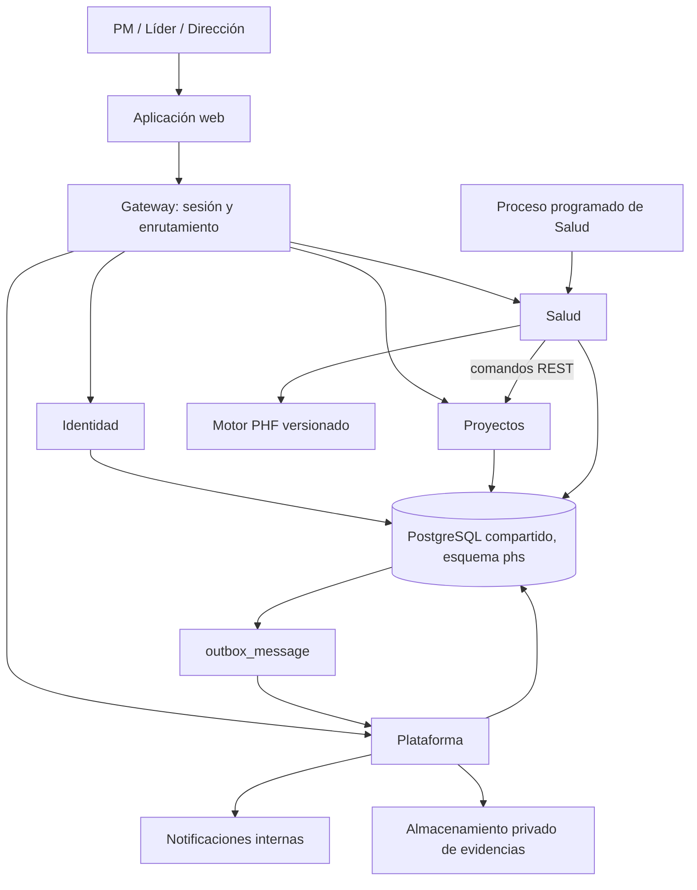

# PHS — Diagnóstico y arquitectura inicial

Estado: propuesta para discusión, basada en los documentos y el código existentes. No constituye una aplicación implementada ni una validación de negocio del PHF.

## 1. Material revisado

| Archivo | Contenido y utilidad |
| --- | --- |
| `Project-Health-System-Prototype/phf.html` | Documento interactivo del Project Health Framework: principios, seis componentes, definiciones, objetivos, reglas y alcance MVP. Incluye notas de validación locales. |
| `Project-Health-System-Prototype/flujo-phf.html` | Proceso de once etapas y retroalimentación mediante aprobación de cambios y nuevas líneas base. |
| `Project-Health-System-Prototype/index.html` | Aplicación de demostración con HTML, CSS y JavaScript integrados; catálogo ampliado PHF, pantallas, reglas, simulación temporal y escenarios de prueba. |
| `Project-Health-System-Prototype/README.md` | Instrucciones, mapa de pantallas, fórmulas resumidas, guion de prueba y limitaciones. |
| `Project-Health-System-Prototype/app.py` | Servidor de archivos estáticos de Python. No implementa API ni persistencia. |
| `Project-Health-System-Prototype/run.command` | Arranque del servidor. |

La revisión fue documental y estática del código; no se ejecutó una prueba funcional completa en navegador. No hay dependencias declaradas, base de datos, autenticación real ni suite de pruebas dentro de esta carpeta.

## 2. Producto que describen

Una aplicación web para gobernar la salud de proyectos y servicios de una práctica. Integra compromisos, ejecución, riesgos, revisiones, evidencia, evaluación y acciones. El framework separa el estado administrativo del proyecto de su salud y busca mantener la revisión normal por debajo de un minuto.

Recorrido: definir proyecto → establecer línea base → operar → ordenar timeline → anticipar → revisar → identificar eventos → evaluar → actuar → gobernar → aprender.

Experiencias principales:

- PM: proyectos asignados, compromisos, revisión pendiente y acciones del día.
- Líder: proyectos de su práctica, intervención, aprobación de cambios y validaciones.
- Dirección: portafolio autorizado, exposición, tendencia y focos de atención.

El prototipo contempla seis dimensiones: desempeño 25%, finanzas 20%, riesgos 20%, cliente 12%, gobernanza 13% y equipo 10%. Calcula un promedio ponderado sobre dimensiones con datos, limitado por reglas críticas; además presenta confianza, tendencia y pronóstico determinista. Estos coeficientes son implementación del prototipo, no evidencia de calibración del modelo.

## 3. Hallazgos que afectan al diseño

| Evidencia | Implicación para la aplicación |
| --- | --- |
| `index.html:1188–1215`: estado completo en localStorage; los errores de guardado se silencian. | Persistencia central, transacciones y errores visibles. |
| `index.html:1253`: `projectsForRole()` devuelve todos los proyectos. | Permisos reales por usuario, práctica y proyecto en servidor. |
| `index.html:1293–1332`: avance por conteo de hitos; un hito en curso aporta 50%; gasto esperado proporcional al calendario. | Validar fórmulas por tipo de servicio; distinguir puntos porcentuales de porcentajes y consumo de presupuesto de desviación económica. |
| `index.html:1480` y siguientes: tendencia sobre los dos últimos snapshots; `snapshotScores()` registra por motivos variados. | Definir cortes de ciclo comparables para evitar que cambios dentro del día aparenten tendencia entre ciclos. |
| `saveBaseline()` y `applyChangeDecision()`: la baseline conserva cantidad de hitos, no el detalle de sus compromisos. | Versionar fechas, alcance y compromisos completos para reconstruir cada baseline. |
| `applyChangeDecision()`: un cambio de días puede desplazar todos los hitos abiertos. | Registrar explícitamente los hitos afectados y el impacto aprobado de cada uno. |
| `submitReview()`: calcula salud antes de insertar la revisión y actualizar el ciclo. | El snapshot puede no reflejar el nuevo clima del cliente o la revisión recién realizada; evaluar sobre el estado final de la operación. |
| `submitReview()` y `validateReview()`: la revisión pendiente ya modifica información operativa y avanza el ciclo; devolverla genera una tarea. | Acordar cuándo una revisión adquiere vigencia y cómo se corrige/reenvía. |
| `syncEvents()` cierra tareas automáticas cuando desaparece su condición. | Distinguir condición resuelta de acción completada y exigir evidencia donde corresponda. |
| El historial se recorta: 40 snapshots, 200 eventos y límites de logs. | Diseñar retención explícita; conservar trazabilidad sin esos recortes de demostración. |
| El framework dice “cada alerta genera acción”; el prototipo admite desactivar automatización y no genera tarea para todos los tipos. | Definir alertas informativas, accionables y vinculadas a una acción ya existente; evitar tareas recursivas por tareas vencidas. |

Las referencias son al código original revisado. La expresión documental “baseline vigente + cambios aprobados” debe interpretarse sin sumar dos veces cambios ya incorporados en la versión vigente.

## 4. Arquitectura lógica

**Decisión del usuario, 2026-10-03 ([ADR-002](adr/002-microservicios.md)):** arquitectura de microservicios con cuatro servicios de negocio y un gateway, base PostgreSQL compartida con el esquema actual y comunicación por REST y eventos mediante outbox. Sustituye la propuesta original de un backend modular único. El motor PHF debe seguir pudiendo probarse sin interfaz, red o base de datos.

| Servicio | Módulos que agrupa | Tablas que escribe |
| --- | --- | --- |
| Gateway | Entrada única, validación de sesión y propagación de identidad. | Ninguna |
| Identidad | Identidad y acceso. | `app_user`, `user_credential`, `user_session`, `practice`, `practice_membership` |
| Proyectos | Proyectos y compromisos; baselines y cambios. | `client`, `service_type`, `project`, `project_member`, `milestone`, `risk`, `renewal`, `financial_observation`, `project_change`, `change_decision`, `baseline` |
| Salud | Revisiones; motor PHF; eventos y acciones; consultas de gobierno. | `review_policy`, `review_cycle`, `review_draft`, `health_review`, `review_validation`, `rule_set`, `health_assessment`, `health_event`, `health_task` |
| Plataforma | Evidencias; consulta de historial y auditoría; outbox y notificaciones. | `evidence`, `notification_delivery`; procesa `outbox_message` |

Reglas: una tabla tiene un solo servicio que la escribe y los demás pueden leerla. `audit_entry`, `activity` y `outbox_message` son tablas compartidas de solo inserción: cada servicio las inserta en la misma transacción que su cambio. El mapa completo por pantalla está en [MAPA-TRAZABILIDAD.md](MAPA-TRAZABILIDAD.md).

### Responsabilidades

| Módulo | Responsabilidad |
| --- | --- |
| Identidad y acceso | Usuarios, prácticas, membresías y autorización por recurso. Identidad del autor obtenida de la sesión. |
| Proyectos y compromisos | Clientes, proyectos, equipos, hitos, riesgos, renovaciones y datos económicos. |
| Baselines y cambios | Versiones inmutables, propuesta de impactos, decisión autorizada y aplicación transaccional. |
| Revisiones | Ciclos, expectativas, borradores, envío, devolución, reenvío y validación. |
| Motor PHF | Métricas, dimensiones, gates, score, confianza, tendencia y forecast con explicación. |
| Eventos y acciones | Condiciones detectadas, episodios, responsables, prioridades, seguimiento y cierre. |
| Consultas de gobierno | Portafolio, timeline y vistas según alcance de acceso. |
| Evidencias y auditoría | Archivos privados, metadatos y registro de quién cambió qué y cuándo. |

La arquitectura se concreta en el [stack](STACK-TECNOLOGICO.md): React/Vite, TypeScript, un servicio NestJS por cada fila de la tabla anterior, PostgreSQL y migraciones SQL. El stack y la identidad local están confirmados; la validación de integración y el proveedor de infraestructura siguen por definir. La presencia de `app.py` no establece una preferencia de backend.

## 5. Modelo de datos inicial

| Entidades | Relaciones y datos esenciales |
| --- | --- |
| Practice, User, PracticeMembership | Organización interna y alcance de acceso. Supuesto inicial: una empresa con varias prácticas; SaaS multiempresa requiere otra decisión. |
| Client, Project, ProjectMembership | Proyecto asociado a cliente y práctica; responsables referencian usuarios. |
| Baseline, BaselineMilestone | Proyecto con versiones numeradas; compromisos completos por versión y una sola baseline vigente. |
| Milestone, MilestoneUpdate | Compromiso operativo, evidencia de cumplimiento e historial. |
| Risk, RiskUpdate | Probabilidad, impacto, responsable, mitigación y evolución. |
| ProjectChange, ChangeImpact, ChangeDecision | Impactos sobre elementos concretos, autor, aprobador y baseline resultante. |
| FinancialObservation | Costo/esfuerzo observado con fecha efectiva, moneda y origen; presupuesto en baseline. |
| ReviewCycle, HealthReview, ReviewRevision, ReviewValidation | Ciclo y revisiones con correcciones conservadas y decisiones trazables. |
| RuleSet, HealthAssessment | Versión de reglas, baseline, fecha efectiva, revisión de datos, entradas y resultados por dimensión. |
| HealthEvent, HealthTask, TaskUpdate | Episodio de una condición, acciones asociadas, asignación y seguimiento. |
| Evidence | Archivo o texto, autor, entidad referida, tipo, tamaño y acceso privado. |
| AuditEntry, OutboxMessage, NotificationDelivery | Auditoría, trabajos persistentes y estado de entrega. |

Aclaración del 2026-10-03: `BaselineMilestone`, `MilestoneUpdate`, `RiskUpdate`, `ChangeImpact`, `ReviewRevision` y `TaskUpdate` no son tablas. El esquema los resuelve con los snapshots JSONB de `baseline`, `project_change.requested_impact`, las filas sucesivas de `health_review` y la tabla `activity`. La identidad local añadió `user_credential` y `user_session`.

Restricciones: claves foráneas, versión de baseline única por proyecto, importes decimales, fechas válidas y control de concurrencia por versión. Las fechas de compromiso son fechas de negocio; las operaciones llevan timestamp UTC y se interpretan usando la zona horaria configurada.

Conservar una evaluación histórica sin recalcularla silenciosamente con reglas nuevas. Las recalculaciones retrospectivas se identifican como tales. Dirección debe poder ver el dato y la regla que explican cada resultado.

## 6. Operaciones críticas

### Aprobar cambio

Ocurre completo dentro del servicio Proyectos, en una transacción.

1. Verificar permiso y que el cambio siga propuesto.
2. Bloquear o comprobar la versión del proyecto y baseline vigente.
3. Validar impactos y crear baseline N+1 con detalle completo.
4. Aplicar solamente los compromisos incluidos en el cambio.
5. Registrar decisión, auditoría y mensaje de trabajo en la misma transacción.
6. Recalcular con la nueva referencia; reintentar una aprobación no debe aplicar el impacto otra vez.

### Enviar revisión

Cruza Salud y Proyectos: con microservicios deja de ser una transacción única. [ADR-002](adr/002-microservicios.md) propone que Salud aplique los cambios operativos con comandos idempotentes de Proyectos y después registre la revisión; el protocolo está pendiente de validar (PHS-003, D02). Los pasos siguientes describen el resultado que debe garantizarse.

1. Revalidar expectativas en servidor y detectar modificaciones concurrentes.
2. Verificar campos y evidencia; bloquear “nada cambió” ante condiciones que requieren tratamiento.
3. Guardar la revisión y el estado operativo resultante de forma coherente.
4. Calcular evaluación sobre ese estado final y vincularla a sus entradas.
5. Aplicar la política de validación y del siguiente ciclo.

Propuesta pendiente de validación: distinguir evaluación provisional de validada cuando intervenga el líder. La vista debe declarar cuál está mostrando. Una devolución conserva la revisión original y permite una nueva revisión corregida; no borra historia.

### Evaluación por calendario

Ejecutar sin depender de que alguien abra el navegador. Procesar proyectos al llegar una fecha relevante, al cambiar datos y mediante reconciliación programada. Registrar fecha efectiva y versión de datos. Serializar o comprobar versiones para impedir que un cálculo atrasado reemplace otro más reciente.

Deduplicar eventos por proyecto, regla, entidad y episodio. Un vencimiento persistente conserva el episodio; una recurrencia posterior crea otro. El trabajo reintentado no duplica tareas ni notificaciones. Una tarea vencida escala la tarea existente.

## 7. Contratos iniciales de API

Prefijo propuesto `/api/v1`; toda consulta aplica permisos, paginación y filtros permitidos.

| Operación | Contrato conceptual |
| --- | --- |
| Sesión (Identidad) | `POST /session`, `DELETE /session`, `GET /session`, cambio de contraseña propio. |
| Administración (Identidad) | Usuarios, credencial inicial y restablecimiento, prácticas y membresías; catálogo de tipos de servicio en Proyectos. |
| Gestión | `GET/POST /projects`, `GET/PATCH /projects/{id}` |
| Compromisos | Recursos de hitos, riesgos, observaciones financieras y renovaciones bajo el proyecto. |
| Baselines | `GET /projects/{id}/baselines`; alta inicial y posteriores mediante casos de uso autorizados. |
| Cambios | `POST /projects/{id}/changes`, `POST /changes/{id}/decisions` |
| Ciclo (Salud) | Consultar y configurar política y ciclos de revisión del proyecto. |
| Revisión | `GET /projects/{id}/expectations`, crear borrador, enviar revisión y registrar validación. |
| Evaluación | `GET /projects/{id}/assessments/latest`, consultas históricas y detalle explicativo. |
| Eventos y alertas (Salud, Plataforma) | Consultar eventos y episodios del proyecto; bandeja de alertas y marcar notificaciones como leídas. |
| Acciones | Consultar tareas autorizadas y registrar actualizaciones con transición de estado válida. |
| Gobierno | Consultas de portafolio, timeline y auditoría según alcance. |
| Evidencias | Carga autorizada y descarga temporal de archivos privados. |

Los contratos de lo ya construido están en OpenAPI, uno por servicio, en [docs/api](api/README.md); el gateway publica el contrato externo. Las filas de esta tabla que aún no tienen implementación siguen siendo conceptuales. Los comandos de decisión/envío aceptarán una clave de idempotencia; actualizaciones concurrentes devolverán conflicto de versión en lugar de sobrescribir datos ajenos.

## 8. Permisos y operación

Propuesta inicial: PM edita proyectos asignados y envía revisiones; líder valida y decide cambios en su práctica; Dirección consulta su alcance. Añadir administración de usuarios y catálogos como capacidad explícita. Confirmar quién puede aprobar cambios propios y quién puede consultar datos económicos.

Separar desarrollo, pruebas y producción. La fecha simulada y los escenarios demo pertenecen al entorno de pruebas. Mantener respaldos con restauración comprobada, migraciones versionadas, logs sin evidencias sensibles, métricas de fallos y alertas de trabajos atrasados. Definir con negocio retención, recuperación, disponibilidad y volumen esperado antes de dimensionar infraestructura.

Evidencias con autorización en cada acceso, límites de tamaño y validación del contenido. El servidor controla cálculos y permisos; el cliente no envía un score como autoridad.

## 9. Construcción por entregas

| Entrega | Resultado verificable |
| --- | --- |
| 1. Especificación PHF | Resolver fórmulas, unidades, ciclos, aprobación y cierre mediante ejemplos con resultado esperado. |
| 2. Base multiusuario | Acceso real, proyectos, membresías, baseline inicial, persistencia y auditoría. |
| 3. Operación y salud | Hitos, riesgos, datos económicos y motor probado con los escenarios del prototipo. |
| 4. Ciclo completo | Expectativas, revisión, validación, eventos y tareas con procesos programados. |
| 5. Gobierno y cambios | Cambios aprobados, baselines históricas, portafolio, timeline y explicaciones. |
| 6. Piloto | Evidencias, operación, restauración, permisos y medición de revisión normal menor a un minuto. |

Pruebas de aceptación necesarias: límites exactos de gates (>10 y >3), ausencia de datos, aplicación única de cambios, concurrencia, permisos entre proyectos, fechas de calendario, revisión devuelta, duplicación por reintentos, reconstrucción histórica y cálculo sin navegador abierto. Los tres proyectos demo sirven como escenarios de referencia, no como validación automática de las fórmulas.

## 10. Decisiones pendientes

1. Aplicación interna de una empresa o plataforma multiempresa.
2. Infraestructura permitida, tecnologías del equipo e identidad corporativa disponible.
3. Volumen inicial de usuarios/proyectos y requisitos de disponibilidad y recuperación.
4. Fórmulas oficiales, tratamiento de proyectos sin datos y calibración por tipo de servicio.
5. Efecto de aprobación/devolución de revisiones, separación de funciones y cierre automático de acciones.
6. Semanal/quincenal como días transcurridos; mensual por calendario o cada 30 días (el prototipo usa 30).
7. Canales de notificación del MVP y necesidad de migrar datos locales existentes.

Siguiente paso de implementación: resolver las decisiones 1, 2, 4 y 5, formalizar contratos y esquema, y construir la primera entrega vertical: acceso → proyecto → baseline → hito → evaluación explicable.

## Diseño físico de datos

Se propone PostgreSQL como base transaccional del MVP. El esquema, las garantías y las responsabilidades del backend están documentados en [DATABASE-PHS.md](DATABASE-PHS.md), con migración en `db/migrations/001_initial.sql` y pruebas de integridad en `db/tests/001_integrity.sql`.
