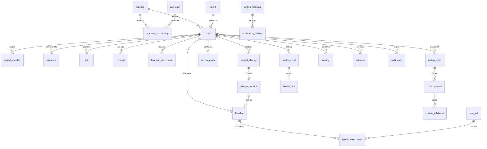

# Diseño de base de datos PHS

Propuesta inicial implementada como DDL para PostgreSQL 17 o posterior. Basada en `phf.html`, `flujo-phf.html`, el prototipo y `ARQUITECTURA-PHS.md`. No se ha instalado en una base de negocio.

## Alcance y decisiones

Una sola base PostgreSQL cubre los datos transaccionales, consultas de portafolio, historial y una bandeja de trabajos persistentes. No se necesita otra base para el MVP. Esto no sustituye el backend, el motor de cálculo o el proceso que ejecuta trabajos programados. El dimensionamiento queda pendiente del volumen real.

Supuesto: aplicación interna de una empresa con varias prácticas. Un cliente puede tener proyectos en varias prácticas. No implementa aislamiento SaaS entre empresas. Los usuarios se identifican por emisor y sujeto de un proveedor de identidad; no se almacenan contraseñas. Aclaración del 2026-10-03 (BIT-0005): el usuario decidió validar la identidad del MVP en esta base; la migración inicial no cambia y la credencial local se añadirá en una migración nueva (PHS-004/PHS-005), guardando solo el hash.

- UUID para entidades de negocio; `date` para compromisos y `timestamptz` para operaciones.
- Dinero y horas con `numeric`, sin aritmética monetaria de punto flotante. La moneda del proyecto debe conservarse durante su vida; las observaciones usan esa moneda.
- Tablas relacionales para operaciones y relaciones. JSONB para versiones completas de reglas, entradas de evaluaciones, propuestas y snapshots históricos.
- Campos de estado con CHECK, catálogos de servicios configurables y claves foráneas compuestas para impedir referencias entre proyectos distintos.
- Se guardan los metadatos y claves de las evidencias; las imágenes se almacenan en archivos privados o almacenamiento de objetos. No se guardan data URI del navegador.
- Ausencia de score se representa con NULL; no se convierte en cero ni en un proyecto saludable.

PostgreSQL permite aplicar [restricciones y claves foráneas](https://www.postgresql.org/docs/17/ddl-constraints.html) y conservar estructuras de snapshot en [JSONB](https://www.postgresql.org/docs/17/datatype-json.html). Las relaciones operativas no se ocultan dentro de un único documento JSON.

## Mapa de entidades



## Propiedad de tablas por servicio

Decisión del 2026-10-03 ([ADR-002](adr/002-microservicios.md)): los microservicios comparten esta base y este esquema, con todas sus claves foráneas. Cada tabla la escribe un solo servicio; los demás pueden leerla.

| Servicio | Tablas que escribe |
| --- | --- |
| Identidad | `app_user`, `user_credential`, `user_session`, `practice`, `practice_membership` |
| Proyectos | `client`, `service_type`, `project`, `project_member`, `milestone`, `risk`, `renewal`, `financial_observation`, `project_change`, `change_decision`, `baseline` |
| Salud | `review_policy`, `review_cycle`, `review_draft`, `health_review`, `review_validation`, `rule_set`, `health_assessment`, `health_event`, `health_task` |
| Plataforma | `evidence`, `notification_delivery`; procesa `outbox_message` |
| Todos, solo inserción | `audit_entry`, `activity`, `outbox_message`, dentro de la transacción del cambio que registran |

Desde la migración 005 la base impone esta propiedad mediante un rol de PostgreSQL por servicio, separado del propietario de migraciones; ver más abajo. Excepción de lectura: `user_credential` y `user_session` solo las lee Identidad. Las migraciones siguen en un solo historial; un cambio de esquema puede afectar a varios servicios. Donde este documento dice "el backend debe", se refiere al servicio dueño de la tabla.

## Diccionario por módulo

| Módulo | Tablas | Contenido |
| --- | --- | --- |
| Acceso | `app_user`, `user_credential`, `user_session`, `practice`, `practice_membership` | Identidad, credencial local (solo hash), sesiones de servidor, práctica y roles PM/líder/dirección/administración. |
| Proyectos | `client`, `service_type`, `project`, `project_member` | Cliente, tipo de servicio, fechas, moneda, responsables y equipo. |
| Operación | `milestone`, `risk`, `renewal` | Compromisos y estados actuales. El vencimiento se deriva de la fecha; no es un estado persistido. |
| Economía | `financial_observation` | Observaciones acumuladas de costo y esfuerzo; fecha efectiva y fecha de registro. Correcciones enlazan la observación sustituida. No sumar acumulados. |
| Control de cambios | `project_change`, `change_decision`, `baseline` | Propuesta inmutable, una decisión por propuesta, baseline completa por versión. |
| Revisiones | `review_policy`, `review_cycle`, `review_draft`, `health_review`, `review_validation` | Política actual, política congelada por ciclo, borradores y envíos/reenvíos con decisiones conservadas. |
| Salud | `rule_set`, `health_assessment` | Reglas versionadas y resultados explicables con datos de entrada, dimensiones, gates, confianza y forecast. |
| Acciones | `health_event`, `health_task`, `activity` | Episodios, responsables, plazos, cierre e historial operativo de hitos/riesgos/tareas. |
| Soportes | `evidence` | Texto o metadatos de archivo, vinculados a exactamente una entidad del mismo proyecto. |
| Plataforma | `audit_entry`, `outbox_message`, `notification_delivery` | Auditoría, trabajos transaccionales y entregas deduplicadas por destinatario/canal. |

## Identidad local (migración 002)

Decisión D06 del 2026-10-03: el MVP valida la identidad en esta base. `002_user_credentials.sql` añade:

- `app_user`: el correo es el nombre de acceso; no puede estar vacío ni tener espacios al inicio o final y es único sin distinguir mayúsculas (`lower(email)`). Un usuario local recibe por defecto emisor `local` y un sujeto generado, de modo que un proveedor OIDC pueda convivir después.
- `user_credential`: una fila por usuario con `password_hash` en formato PHC de Argon2id (el CHECK rechaza texto plano y otros algoritmos), `must_change_password` (verdadero al crearla), `password_changed_at`, `failed_attempts`, `locked_until`, `last_login_at` y quién la creó.

La base solo comprueba el formato del hash. Corresponde al backend (PHS-005): calcular y verificar Argon2id, elegir sus parámetros, la política de contraseñas, contar intentos y bloquear, responder sin revelar si el correo existe y no escribir nunca contraseñas ni hashes en `audit_entry`, `activity`, outbox o logs. Un usuario sin fila en `user_credential` o con `active = false` no puede iniciar sesión. Las sesiones se añadieron después, en la migración 003.

## Sesiones (migración 003)

Decisión del usuario del 2026-10-03: tabla de sesiones propia en lugar de la tabla de una biblioteca o de tokens firmados sin estado. `003_user_session.sql` crea `user_session`:

- `token_hash`: SHA-256 en hexadecimal del token aleatorio que viaja en la cookie. El token en claro no se guarda; quien lea la tabla no puede suplantar una sesión.
- `expires_at`: límite absoluto. La caducidad por inactividad la calcula el backend con `last_seen_at`.
- `revoked_at` y `revoke_reason` (`logout`, `password_change`, `user_disabled`, `admin`): siempre juntos. Revocar todas las sesiones de un usuario es un solo UPDATE.
- `ip_address` y `user_agent` opcionales, para mostrar sesiones activas. Son datos personales: su retención entra en D07.

Una sesión es válida si no está revocada, no ha expirado y su usuario sigue activo; esta última condición la comprueba el backend en cada petición. También le corresponde generar el token con un generador criptográfico, rotarlo al iniciar sesión, limitar la frecuencia de actualización de `last_seen_at`, revocar al cambiar contraseña o desactivar al usuario y borrar periódicamente las sesiones vencidas. La tabla es mutable y admite borrado: no forma parte del historial de negocio; los inicios y cierres de sesión relevantes se registran en `audit_entry` sin incluir el token ni su hash.

## Líneas base

`project.current_baseline_id` señala la única referencia vigente y solo puede apuntar a una baseline del propio proyecto. Las anteriores no cambian de contenido. La versión inicial no necesita cambio previo; cada versión posterior requiere una decisión aprobada y una versión anterior consecutiva. Una aprobación solo puede originar una baseline.

La cabecera conserva alcance, fechas, presupuesto, horas y moneda. `milestone_snapshot` conserva el detalle completo de los compromisos de esa versión. Se utiliza un snapshot, deliberadamente, para que renombrar o reprogramar un hito no altere el documento aprobado. Formato contractual propuesto:

```json
{
  "milestone_snapshot": [
    {"id":"UUID","title":"Entrega","deliverable":"Versión aceptada","due_on":"2026-12-01","owner_id":"UUID","owner_name":"Nombre","critical":true,"weight":1}
  ],
  "team_snapshot": [
    {"user_id":"UUID","display_name":"Nombre","role":"contributor","allocation_pct":100}
  ]
}
```

El DDL verifica que sean arrays; el backend debe validar su estructura, IDs, contenido completo y coherencia con el proyecto antes de insertarlos. No son relaciones navegables mediante FK. Si se requiere análisis intensivo de compromisos entre versiones, puede añadirse una proyección relacional sin modificar el snapshot aprobado.

Aprobación en una transacción: bloquear el proyecto (`SELECT ... FOR UPDATE`), comprobar versión vigente y permiso, insertar decisión, crear baseline completa, actualizar compromisos afectados, mover el puntero vigente, incrementar revisión, insertar auditoría y outbox, confirmar. Rechazar conserva la propuesta sin generar baseline. La API debe tratar un reintento como la misma decisión, no como una nueva operación.

## Revisiones y evaluaciones

Cada ciclo guarda la política con la que se abrió. “Mensual” se propone como mes calendario; no se codifica todavía un cálculo de próximas fechas en SQL. Borrador es mutable; cada envío es una fila inmutable de `health_review`. Una devolución produce otra revisión del mismo ciclo con `supersedes_id`, conservando la anterior.

El backend debe verificar que un reenvío siga a una revisión devuelta y use el siguiente número. La decisión de un líder se registra una sola vez por envío. Pendiente se deriva de la política y de la ausencia de decisión; no se confunde con validada.

Las evaluaciones tienen:

- `rule_set_id`, `engine_version` en el ruleset, baseline y snapshot de entradas para reproducibilidad.
- `effective_on`, `project_revision` y fecha de cálculo para impedir publicar resultados obsoletos.
- Tipo operativo, corte de ciclo o recálculo retrospectivo; publicación provisional u oficial.
- Score, promedio, tope, resultados por dimensión y gates activados; NULL si no hay datos suficientes.

La fórmula completa permanece en el motor de negocio; SQL verifica rangos y `score = least(weighted_score, gate_cap)` sobre valores persistidos con igual precisión. Las reglas y snapshots se agregan, no se sobrescriben. Para hacer oficial un resultado provisional se inserta otra evaluación. Comparar tendencia entre cortes oficiales de ciclos; excluir retrospectivos de la consulta habitual del portafolio.

No se precargan los coeficientes del prototipo como política aprobada. Se conserva la posibilidad de usarlos como una versión explícita para pruebas.

## Eventos, acciones e historial

Un índice único parcial permite un solo evento abierto por proyecto y `condition_key`. La clave se construye de forma canónica con regla, tipo de entidad e identificador. La recurrencia abre un episodio nuevo. `automation_key` evita duplicar la tarea de un episodio. Los reintentos usan estas claves en lugar de IDs recién generados.

Resolver el evento no completa automáticamente la tarea: completar o cancelar requiere fecha y comentario. Una tarea vencida se escala sobre la misma tarea, sin crear recursivamente otras tareas.

`activity` conserva las actualizaciones de hitos, riesgos y tareas con antes/después. `audit_entry` registra las operaciones de la aplicación. Sus registros históricos tienen triggers que rechazan UPDATE/DELETE. Esto no genera por sí solo los registros: el backend debe insertarlos en la transacción correspondiente. No es protección frente al propietario de la base o un superusuario; estos también pueden alterar triggers o truncar tablas.

## Garantías y límites

| Garantizado por el DDL | Debe implementarse en backend/despliegue |
| --- | --- |
| Tipos, rangos, fechas ordenadas y referencias válidas. | Identidad de sesión, permisos por práctica/proyecto y separación de funciones. |
| Referencias del mismo proyecto en baselines, evidencias, revisiones, eventos y tareas. | Elegibilidad de responsables, validación de zona horaria y catálogo de monedas. |
| Una decisión por cambio/envío y baseline posterior vinculada a aprobación. | Transacción completa de aprobación, impedir retroceder el puntero vigente y mantener moneda coherente. |
| Historial protegido ante UPDATE/DELETE ordinario. | Rol de aplicación sin permisos de DDL/TRUNCATE; registrar toda operación y controlar cargas tardías de evidencia. |
| Una condición abierta y tarea automática deduplicada por clave. | Algoritmo canónico de claves, reintentos y numeración de episodios. |
| Score dentro de rango y coherente con promedio/tope. | Fórmulas, dimensiones, snapshots completos, estado oficial y evaluación sobre datos correctos. |
| Un vínculo por evidencia con metadatos obligatorios para archivo. | Validar formato/tamaño real, autorización de descarga y disponibilidad del archivo. |

No se configura RLS en esta migración: la API será la única vía de acceso del usuario final. No entregar credenciales de base de datos a clientes web. Las membresías expresan permisos de negocio, pero no los ejecutan. El rol de aplicación y sus grants se definirán en el despliegue, separados del propietario de migraciones.

Los campos `revision` no aumentan solos: el caso de uso debe comprobar versión e incrementar la del proyecto cuando cambie cualquier dato de entrada del motor. Si aumenta un hijo, también se incrementa la revisión del proyecto en la misma transacción.

## Endurecimiento y roles (migraciones 004 y 005)

`004_integrity_hardening.sql` corrige hallazgos de la revisión de BIT-0005: los textos obligatorios de práctica, cliente, tipo de servicio, proyecto, hito, riesgo, cambio, evento y tarea no pueden ser vacíos; una nota de resolución no puede quedar en blanco; `outbox_message.processed_at` no puede preceder a su creación; y proyecto, hito, riesgo, renovación, evento y tarea no admiten `DELETE`: cambian de estado.

`005_service_roles.sql` hace cumplir la propiedad de tablas de [ADR-002](adr/002-microservicios.md) con cuatro roles de grupo sin inicio de sesión: `phs_identity`, `phs_projects`, `phs_health` y `phs_platform`. Cada uno lee el modelo compartido, escribe solo sus tablas e inserta en `audit_entry`, `activity` y `outbox_message`. Solo Identidad puede leer `user_credential` y `user_session`. Ningún rol de servicio puede hacer DDL ni `TRUNCATE`. La prueba 005 verifica que ninguna tabla tenga más de un servicio con `UPDATE` o `DELETE`.

El despliegue crea los usuarios con contraseña y los hace miembros del rol de su servicio; las contraseñas no están en las migraciones. Aplicar la 005 requiere un propietario con permiso para crear roles. El propietario no debe llamarse igual que el esquema (`phs`): PostgreSQL lo tomaría como esquema por defecto mediante `"$user"` y dbmate buscaría ahí su tabla de control.

## Instalación y validación

Desde BIT-0010 las migraciones se aplican con [dbmate](https://github.com/amacneil/dbmate), que ejecuta cada archivo en una transacción y registra las aplicadas en `public.schema_migrations`. Los archivos ya no contienen `BEGIN/COMMIT` propios y no deben aplicarse con `psql -f`. No tienen reversión destructiva: el bloque `migrate:down` falla a propósito; se corrige con una migración nueva o restaurando un respaldo.

Sin Docker, con el PostgreSQL de Homebrew ya instalado, el proyecto usa una instancia propia en `.local/pg` y el puerto 54329; no toca ningún otro PostgreSQL de la máquina:

```sh
cp .env.example .env
npx pnpm@12.9.1 db:setup     # arranca la instancia local, aplica migraciones y crea usuarios de desarrollo
npx pnpm@12.9.1 db:test      # ejecuta db/tests/*.sql; cada archivo revierte sus datos
npx pnpm@12.9.1 db:status    # migraciones aplicadas y pendientes
npx pnpm@12.9.1 db:local:stop
```

`db:local:reset` borra la instancia local. `db/local/dev_logins.sql` crea los usuarios `phs_*_dev` solo para desarrollo. En otro entorno, `DATABASE_URL` apunta al propietario de migraciones y cada servicio recibe su propia URL.

| Archivo | Contenido |
| --- | --- |
| `001_initial.sql` | Esquema inicial de 28 tablas. |
| `002_user_credentials.sql` | Credencial local y correo único. |
| `003_user_session.sql` | Sesiones de servidor. |
| `004_integrity_hardening.sql` | Textos obligatorios, sin borrado físico, fechas de outbox. |
| `005_service_roles.sql` | Roles y permisos por servicio. |

Pruebas en `db/tests`: `001_integrity.sql` (11 rechazos), `002_credentials.sql` (8), `003_sessions.sql` (7), `004_hardening.sql` (14) y `005_roles.sql` (12 denegaciones de permiso). Se ejecutan con el propietario del esquema.

## Evolución pendiente

Definir política de validación de revisiones, plazos/retención de evidencias, restauración, canales de notificación y permisos financieros. Añadir migraciones, no editar la primera después de aplicarla en un entorno compartido. Índices adicionales y particionamiento se deciden con consultas y volumen medidos.

## Validación realizada

La migración se aplicó correctamente en una instancia temporal aislada de PostgreSQL 17.9. Pasó el recorrido proyecto → baseline inicial → cambio aprobado → nueva baseline → revisión → evaluación → evento → tarea. Se comprobaron 11 rechazos esperados: referencias cruzadas, modificación/borrado de historia, fechas inválidas, decisiones duplicadas, score incoherente, evento abierto duplicado y cierre sin soporte. También se verificó la recurrencia de un evento y que resolverlo no complete silenciosamente su tarea. Todos los datos del escenario se revirtieron. No se ejecutaron pruebas de carga, de permisos de aplicación ni de concurrencia entre sesiones.

Actualización del 2026-10-03 (BIT-0006): sobre otra instancia temporal de PostgreSQL 17.9 se aplicaron 001 y 002 en una base vacía (29 tablas) y pasaron ambos archivos de pruebas, incluidos los 8 rechazos de la credencial local. No se probó la migración 002 sobre una base con usuarios existentes: fallaría si hubiera correos vacíos o repetidos.

Actualización del 2026-10-03 (BIT-0007): en otra instancia temporal de PostgreSQL 17.9 se aplicaron 001–003 sobre una base vacía (30 tablas) y pasaron los tres archivos de pruebas, incluidos los 7 rechazos de sesiones. No se probaron concurrencia ni volumen de sesiones.

Actualización del 2026-10-03 (BIT-0010): en la instancia local del proyecto (PostgreSQL 17.9, sin Docker) dbmate aplicó 001–005 sobre una base vacía (30 tablas), una segunda ejecución no aplicó nada y pasaron los cinco archivos de pruebas. Los servicios Identidad y Proyectos se conectaron con sus usuarios restringidos. No se probó la actualización de una base creada con los archivos anteriores a dbmate: no existe ninguna.
