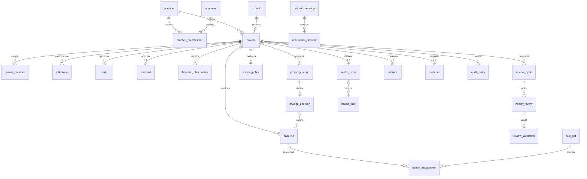

# Diseño de base de datos PHS

Propuesta inicial implementada como DDL para PostgreSQL 17 o posterior. Basada en `phf.html`, `flujo-phf.html`, el prototipo y `ARQUITECTURA-PHS.md`. No se ha instalado en una base de negocio.

## Alcance y decisiones

Una sola base PostgreSQL cubre los datos transaccionales, consultas de portafolio, historial y una bandeja de trabajos persistentes. No se necesita otra base para el MVP. Esto no sustituye el backend, el motor de cálculo o el proceso que ejecuta trabajos programados. El dimensionamiento queda pendiente del volumen real.

Supuesto: aplicación interna de una empresa con varias prácticas. Un cliente puede tener proyectos en varias prácticas. No implementa aislamiento SaaS entre empresas. Los usuarios se identifican por emisor y sujeto de un proveedor de identidad; no se almacenan contraseñas.

- UUID para entidades de negocio; `date` para compromisos y `timestamptz` para operaciones.
- Dinero y horas con `numeric`, sin aritmética monetaria de punto flotante. La moneda del proyecto debe conservarse durante su vida; las observaciones usan esa moneda.
- Tablas relacionales para operaciones y relaciones. JSONB para versiones completas de reglas, entradas de evaluaciones, propuestas y snapshots históricos.
- Campos de estado con CHECK, catálogos de servicios configurables y claves foráneas compuestas para impedir referencias entre proyectos distintos.
- Se guardan los metadatos y claves de las evidencias; las imágenes se almacenan en archivos privados o almacenamiento de objetos. No se guardan data URI del navegador.
- Ausencia de score se representa con NULL; no se convierte en cero ni en un proyecto saludable.

PostgreSQL permite aplicar [restricciones y claves foráneas](https://www.postgresql.org/docs/17/ddl-constraints.html) y conservar estructuras de snapshot en [JSONB](https://www.postgresql.org/docs/17/datatype-json.html). Las relaciones operativas no se ocultan dentro de un único documento JSON.

## Mapa de entidades



## Diccionario por módulo

| Módulo | Tablas | Contenido |
| --- | --- | --- |
| Acceso | `app_user`, `practice`, `practice_membership` | Identidad, práctica y roles PM/líder/dirección/administración. |
| Proyectos | `client`, `service_type`, `project`, `project_member` | Cliente, tipo de servicio, fechas, moneda, responsables y equipo. |
| Operación | `milestone`, `risk`, `renewal` | Compromisos y estados actuales. El vencimiento se deriva de la fecha; no es un estado persistido. |
| Economía | `financial_observation` | Observaciones acumuladas de costo y esfuerzo; fecha efectiva y fecha de registro. Correcciones enlazan la observación sustituida. No sumar acumulados. |
| Control de cambios | `project_change`, `change_decision`, `baseline` | Propuesta inmutable, una decisión por propuesta, baseline completa por versión. |
| Revisiones | `review_policy`, `review_cycle`, `review_draft`, `health_review`, `review_validation` | Política actual, política congelada por ciclo, borradores y envíos/reenvíos con decisiones conservadas. |
| Salud | `rule_set`, `health_assessment` | Reglas versionadas y resultados explicables con datos de entrada, dimensiones, gates, confianza y forecast. |
| Acciones | `health_event`, `health_task`, `activity` | Episodios, responsables, plazos, cierre e historial operativo de hitos/riesgos/tareas. |
| Soportes | `evidence` | Texto o metadatos de archivo, vinculados a exactamente una entidad del mismo proyecto. |
| Plataforma | `audit_entry`, `outbox_message`, `notification_delivery` | Auditoría, trabajos transaccionales y entregas deduplicadas por destinatario/canal. |

## Líneas base

`project.current_baseline_id` señala la única referencia vigente y solo puede apuntar a una baseline del propio proyecto. Las anteriores no cambian de contenido. La versión inicial no necesita cambio previo; cada versión posterior requiere una decisión aprobada y una versión anterior consecutiva. Una aprobación solo puede originar una baseline.

La cabecera conserva alcance, fechas, presupuesto, horas y moneda. `milestone_snapshot` conserva el detalle completo de los compromisos de esa versión. Se utiliza un snapshot, deliberadamente, para que renombrar o reprogramar un hito no altere el documento aprobado. Formato contractual propuesto:

```json
{
  "milestone_snapshot": [
    {"id":"UUID","title":"Entrega","deliverable":"Versión aceptada","due_on":"2026-12-01","owner_id":"UUID","owner_name":"Nombre","critical":true,"weight":1}
  ],
  "team_snapshot": [
    {"user_id":"UUID","display_name":"Nombre","role":"contributor","allocation_pct":100}
  ]
}
```

El DDL verifica que sean arrays; el backend debe validar su estructura, IDs, contenido completo y coherencia con el proyecto antes de insertarlos. No son relaciones navegables mediante FK. Si se requiere análisis intensivo de compromisos entre versiones, puede añadirse una proyección relacional sin modificar el snapshot aprobado.

Aprobación en una transacción: bloquear el proyecto (`SELECT ... FOR UPDATE`), comprobar versión vigente y permiso, insertar decisión, crear baseline completa, actualizar compromisos afectados, mover el puntero vigente, incrementar revisión, insertar auditoría y outbox, confirmar. Rechazar conserva la propuesta sin generar baseline. La API debe tratar un reintento como la misma decisión, no como una nueva operación.

## Revisiones y evaluaciones

Cada ciclo guarda la política con la que se abrió. “Mensual” se propone como mes calendario; no se codifica todavía un cálculo de próximas fechas en SQL. Borrador es mutable; cada envío es una fila inmutable de `health_review`. Una devolución produce otra revisión del mismo ciclo con `supersedes_id`, conservando la anterior.

El backend debe verificar que un reenvío siga a una revisión devuelta y use el siguiente número. La decisión de un líder se registra una sola vez por envío. Pendiente se deriva de la política y de la ausencia de decisión; no se confunde con validada.

Las evaluaciones tienen:

- `rule_set_id`, `engine_version` en el ruleset, baseline y snapshot de entradas para reproducibilidad.
- `effective_on`, `project_revision` y fecha de cálculo para impedir publicar resultados obsoletos.
- Tipo operativo, corte de ciclo o recálculo retrospectivo; publicación provisional u oficial.
- Score, promedio, tope, resultados por dimensión y gates activados; NULL si no hay datos suficientes.

La fórmula completa permanece en el motor de negocio; SQL verifica rangos y `score = least(weighted_score, gate_cap)` sobre valores persistidos con igual precisión. Las reglas y snapshots se agregan, no se sobrescriben. Para hacer oficial un resultado provisional se inserta otra evaluación. Comparar tendencia entre cortes oficiales de ciclos; excluir retrospectivos de la consulta habitual del portafolio.

No se precargan los coeficientes del prototipo como política aprobada. Se conserva la posibilidad de usarlos como una versión explícita para pruebas.

## Eventos, acciones e historial

Un índice único parcial permite un solo evento abierto por proyecto y `condition_key`. La clave se construye de forma canónica con regla, tipo de entidad e identificador. La recurrencia abre un episodio nuevo. `automation_key` evita duplicar la tarea de un episodio. Los reintentos usan estas claves en lugar de IDs recién generados.

Resolver el evento no completa automáticamente la tarea: completar o cancelar requiere fecha y comentario. Una tarea vencida se escala sobre la misma tarea, sin crear recursivamente otras tareas.

`activity` conserva las actualizaciones de hitos, riesgos y tareas con antes/después. `audit_entry` registra las operaciones de la aplicación. Sus registros históricos tienen triggers que rechazan UPDATE/DELETE. Esto no genera por sí solo los registros: el backend debe insertarlos en la transacción correspondiente. No es protección frente al propietario de la base o un superusuario; estos también pueden alterar triggers o truncar tablas.

## Garantías y límites

| Garantizado por el DDL | Debe implementarse en backend/despliegue |
| --- | --- |
| Tipos, rangos, fechas ordenadas y referencias válidas. | Identidad de sesión, permisos por práctica/proyecto y separación de funciones. |
| Referencias del mismo proyecto en baselines, evidencias, revisiones, eventos y tareas. | Elegibilidad de responsables, validación de zona horaria y catálogo de monedas. |
| Una decisión por cambio/envío y baseline posterior vinculada a aprobación. | Transacción completa de aprobación, impedir retroceder el puntero vigente y mantener moneda coherente. |
| Historial protegido ante UPDATE/DELETE ordinario. | Rol de aplicación sin permisos de DDL/TRUNCATE; registrar toda operación y controlar cargas tardías de evidencia. |
| Una condición abierta y tarea automática deduplicada por clave. | Algoritmo canónico de claves, reintentos y numeración de episodios. |
| Score dentro de rango y coherente con promedio/tope. | Fórmulas, dimensiones, snapshots completos, estado oficial y evaluación sobre datos correctos. |
| Un vínculo por evidencia con metadatos obligatorios para archivo. | Validar formato/tamaño real, autorización de descarga y disponibilidad del archivo. |

No se configura RLS en esta migración: la API será la única vía de acceso del usuario final. No entregar credenciales de base de datos a clientes web. Las membresías expresan permisos de negocio, pero no los ejecutan. El rol de aplicación y sus grants se definirán en el despliegue, separados del propietario de migraciones.

Los campos `revision` no aumentan solos: el caso de uso debe comprobar versión e incrementar la del proyecto cuando cambie cualquier dato de entrada del motor. Si aumenta un hijo, también se incrementa la revisión del proyecto en la misma transacción.

## Instalación y validación

Archivos:

- `db/migrations/001_initial.sql`: migración transaccional para una base vacía; no borra ni reemplaza objetos. Falla si `phs` ya existe.
- `db/tests/001_integrity.sql`: recorrido válido y pruebas de restricciones; todas las filas de prueba se revierten.

```sh
psql -X -v ON_ERROR_STOP=1 -d phs -f db/migrations/001_initial.sql
psql -X -v ON_ERROR_STOP=1 -d phs -f db/tests/001_integrity.sql
```

La base destino debe crearse y autorizarse explícitamente en el entorno elegido. No ejecutar sobre una base ajena. El script solo contiene el catálogo de tipos de servicio; no contiene usuarios ni proyectos demo permanentes.

## Evolución pendiente

Definir política de validación de revisiones, plazos/retención de evidencias, restauración, canales de notificación y permisos financieros. Añadir migraciones, no editar la primera después de aplicarla en un entorno compartido. Índices adicionales y particionamiento se deciden con consultas y volumen medidos.

## Validación realizada

La migración se aplicó correctamente en una instancia temporal aislada de PostgreSQL 17.9. Pasó el recorrido proyecto → baseline inicial → cambio aprobado → nueva baseline → revisión → evaluación → evento → tarea. Se comprobaron 11 rechazos esperados: referencias cruzadas, modificación/borrado de historia, fechas inválidas, decisiones duplicadas, score incoherente, evento abierto duplicado y cierre sin soporte. También se verificó la recurrencia de un evento y que resolverlo no complete silenciosamente su tarea. Todos los datos del escenario se revirtieron. No se ejecutaron pruebas de carga, de permisos de aplicación ni de concurrencia entre sesiones.
