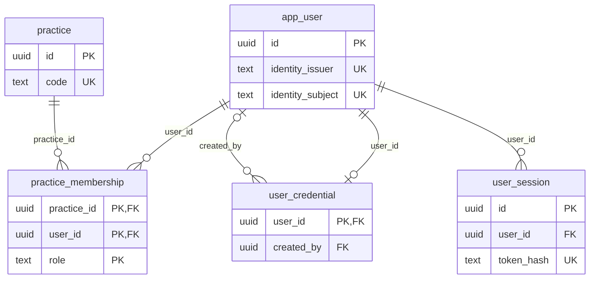
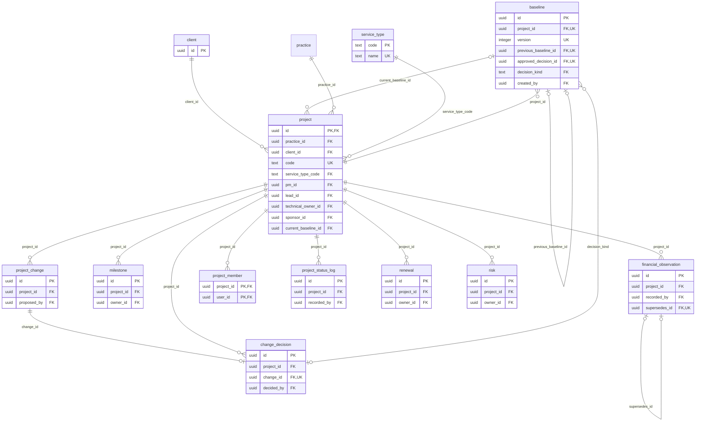
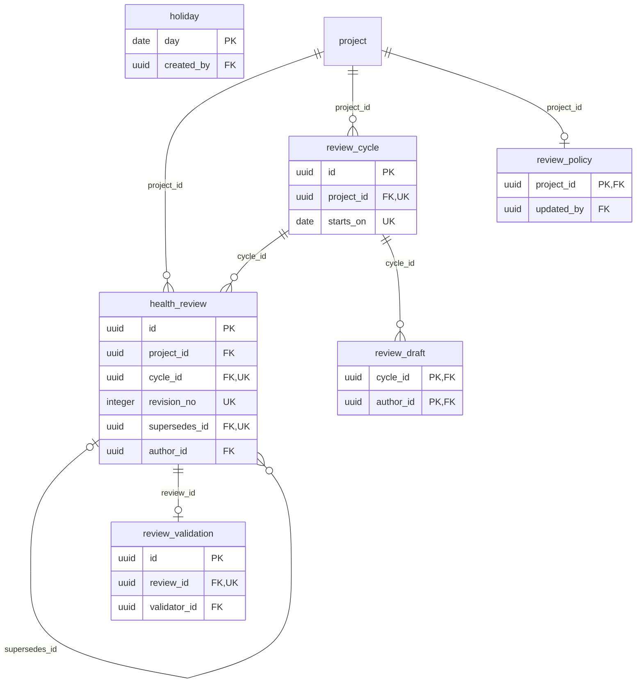
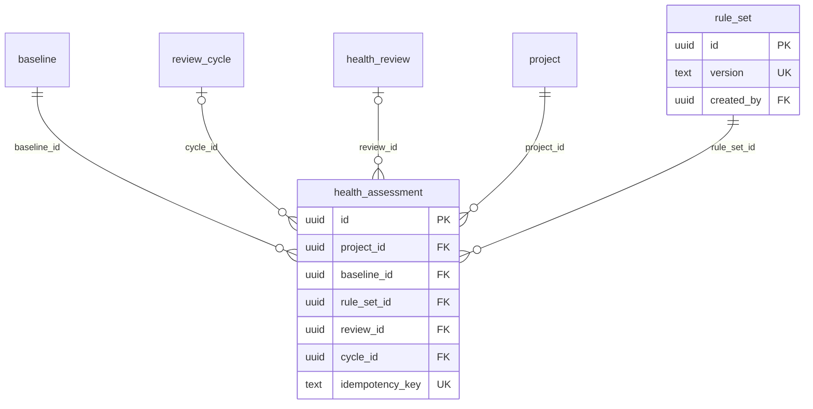
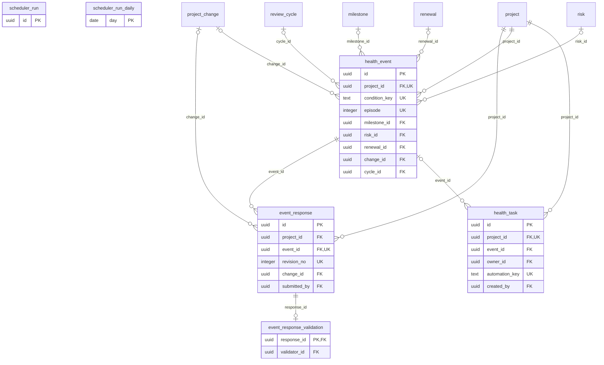
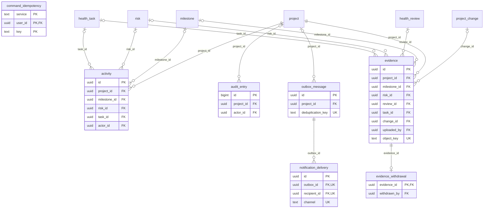

# Diccionario de datos de PHS

Describe el esquema `phs` de PostgreSQL tal como está en la base: 38 tablas y 349 columnas, con 15 migraciones aplicadas (`db/migrations`).

**Este archivo se genera; no se edita a mano.** La estructura (tipos, claves, reglas, índices y permisos) se lee del catálogo de la base y las descripciones están en [diccionario/descripciones.json](diccionario/descripciones.json). Para actualizarlo después de una migración: describir lo nuevo en ese archivo y ejecutar `pnpm db:dictionary`. El generador se niega a escribir si falta una descripción o sobra alguna.

## Cómo leerlo

- **Tipos.** Los de PostgreSQL. `uuid` identifica filas; `timestamptz` es un instante con zona; `date` es un día de calendario; `numeric(p,s)` es un decimal exacto; `jsonb` es un documento JSON; `text[]` es una lista de textos.
- **Nombres.** Una columna terminada en `_on` es una fecha de negocio (`date`); en `_at`, un instante (`timestamptz`); en `_id`, una referencia a otra tabla.
- **Clave.** PK: clave primaria. FK: referencia a otra tabla. UK: forma parte de una restricción de unicidad.
- **Obligatoria.** "Sí" significa que la columna no admite nulo.
- **Quién escribe.** Los cuatro servicios comparten la base, pero cada tabla tiene permisos de escritura para uno solo, salvo las compartidas de solo inserción. Todos pueden leer todas. Los permisos se imponen con un rol de PostgreSQL por servicio.
- **Versión (`revision`).** Varias tablas llevan un contador que aumenta en cada cambio: una edición hecha sobre una versión anterior se rechaza en lugar de pisar el cambio de otra persona.
- **Historia.** Lo ya enviado o decidido no se modifica: se corrige con una fila nueva que referencia a la anterior. Cada tabla indica si es de solo inserción.
- **Claves compuestas con `project_id`.** Muchas referencias incluyen el proyecto además del identificador, para que la base impida relacionar elementos de proyectos distintos.

## Tablas por módulo

### Identidad y acceso

| Tabla | Qué guarda | Escribe | Columnas |
| --- | --- | --- | --- |
| [`app_user`](#app_user) | Persona que usa el sistema o que aparece como responsable de algo. No guarda contraseñas. | Identidad | 8 |
| [`practice`](#practice) | Práctica o unidad de negocio que agrupa proyectos y sobre la que se otorgan roles. | Identidad | 4 |
| [`practice_membership`](#practice_membership) | Rol de un usuario en una práctica. Un usuario puede acumular varios roles en la misma práctica. | Identidad | 3 |
| [`user_credential`](#user_credential) | Credencial local de un usuario. Solo guarda el hash de la contraseña. | Identidad | 9 |
| [`user_session`](#user_session) | Sesión de navegador iniciada. La cookie lleva un token aleatorio; aquí solo queda su huella. | Identidad | 10 |

### Proyectos y compromisos

| Tabla | Qué guarda | Escribe | Columnas |
| --- | --- | --- | --- |
| [`baseline`](#baseline) | Línea base: fotografía versionada de los compromisos contra la que se mide la desviación. No se modifica. | Proyectos | 17 |
| [`change_decision`](#change_decision) | Decisión única sobre una propuesta de cambio. Aprobar publica una nueva línea base. | Proyectos | 7 |
| [`client`](#client) | Cliente para el que se ejecutan proyectos. | Proyectos | 5 |
| [`financial_observation`](#financial_observation) | Observación económica acumulada del proyecto a una fecha. No se edita: una corrección es otra observación que reemplaza a la anterior. | Proyectos | 9 |
| [`milestone`](#milestone) | Hito o entregable comprometido del proyecto. | Proyectos | 13 |
| [`project`](#project) | Proyecto o servicio que se gobierna. Es el eje del modelo: casi todo lo demás cuelga de él. | Proyectos | 21 |
| [`project_change`](#project_change) | Propuesta de cambio a los compromisos del proyecto. No se modifica después de proponerla. | Proyectos | 8 |
| [`project_member`](#project_member) | Integrante del equipo de un proyecto, además de PM, líder, responsable técnico y sponsor. | Proyectos | 4 |
| [`project_status_log`](#project_status_log) | Historial de cambios de estado del proyecto y de las justificaciones que exige la regla de pausa o cierre prolongado (D08). Solo inserción. | Proyectos | 8 |
| [`renewal`](#renewal) | Compromiso de renovar el contrato o servicio en una fecha. | Proyectos | 9 |
| [`risk`](#risk) | Riesgo identificado y su plan de mitigación. | Proyectos | 13 |
| [`service_type`](#service_type) | Catálogo de tipos de servicio que clasifica los proyectos. | Proyectos | 3 |

### Ciclo de revisión

| Tabla | Qué guarda | Escribe | Columnas |
| --- | --- | --- | --- |
| [`health_review`](#health_review) | Health Review enviado. Cuenta para la salud desde que se envía (D02) y no se modifica: una corrección es otra versión del mismo ciclo. | Salud | 15 |
| [`holiday`](#holiday) | Día festivo. Junto con sábados y domingos, son días en que no vence ninguna revisión. Los mantiene el administrador. | Salud | 4 |
| [`review_cycle`](#review_cycle) | Periodo en el que se espera una revisión. El primero se crea al configurar la política y los siguientes al enviar cada revisión. | Salud | 5 |
| [`review_draft`](#review_draft) | Borrador de la revisión que un usuario está capturando en un ciclo. Se borra al enviar. | Salud | 5 |
| [`review_policy`](#review_policy) | Política de revisión del proyecto: cadencia y reglas. Un proyecto sin fila no tiene ciclo configurado. | Salud | 10 |
| [`review_validation`](#review_validation) | Decisión única del líder sobre un envío de revisión. Devolver no anula el envío. | Salud | 6 |

### Motor de salud

| Tabla | Qué guarda | Escribe | Columnas |
| --- | --- | --- | --- |
| [`health_assessment`](#health_assessment) | Resultado guardado de evaluar la salud de un proyecto en una fecha, con todo lo necesario para reproducirlo. No se modifica. | Salud | 20 |
| [`rule_set`](#rule_set) | Versión del conjunto de reglas PHF con la que se calculó una evaluación. | Salud | 6 |

### Eventos y acciones

| Tabla | Qué guarda | Escribe | Columnas |
| --- | --- | --- | --- |
| [`event_response`](#event_response) | Causa y plan que el PM da a una alerta (D04). Solo inserción: tras una devolución se envía otra versión. | Salud | 10 |
| [`event_response_validation`](#event_response_validation) | Decisión única del líder sobre una respuesta de causa y plan. | Salud | 5 |
| [`health_event`](#health_event) | Alerta: un hecho objetivo que indica que algo va mal, con su episodio. Se resuelve sola cuando la condición desaparece. | Salud | 15 |
| [`health_task`](#health_task) | Acción con responsable y plazo. Puede ser automática, creada por una alerta, o manual. | Salud | 16 |
| [`scheduler_run`](#scheduler_run) | Pasada del proceso programado de Salud que actualiza alertas, acciones y evaluaciones. Conserva el detalle de los últimos tres meses. | Salud | 5 |
| [`scheduler_run_daily`](#scheduler_run_daily) | Histórico del proceso programado: resumen por día de las pasadas de más de tres meses. | Salud | 8 |

### Evidencia, historial y mensajería

| Tabla | Qué guarda | Escribe | Columnas |
| --- | --- | --- | --- |
| [`activity`](#activity) | Historial de seguimiento de hitos, riesgos y acciones: cada actualización con su antes y después. Solo inserción, desde cualquier servicio. | Identidad, Proyectos, Salud, Plataforma | 11 |
| [`audit_entry`](#audit_entry) | Bitácora de auditoría: quién hizo qué y cuándo. Se inserta en la misma transacción que el cambio y nunca se modifica. | Identidad, Proyectos, Salud, Plataforma | 10 |
| [`command_idempotency`](#command_idempotency) | Resultado guardado de un comando, para que repetir la misma petición devuelva la misma respuesta sin ejecutarla dos veces. | Identidad, Proyectos, Salud, Plataforma | 8 |
| [`evidence`](#evidence) | Evidencia privada de un hito, riesgo, revisión, acción o cambio: texto, archivo o ambos. No se modifica ni se borra; se retira con motivo. | Plataforma | 16 |
| [`evidence_withdrawal`](#evidence_withdrawal) | Retiro de una evidencia. La evidencia se conserva, pero su contenido deja de servirse. | Plataforma | 4 |
| [`notification_delivery`](#notification_delivery) | Notificación entregada a un usuario por un canal, originada en un mensaje del outbox. | Plataforma | 8 |
| [`outbox_message`](#outbox_message) | Mensaje que un servicio publica en la misma transacción que su cambio, para que Plataforma lo procese después (notificaciones). Entrega al menos una vez. | Identidad, Proyectos, Salud, Plataforma | 11 |

## Diagrama entidad-relación general

Todas las tablas y sus relaciones. Para que se pueda leer se omiten las columnas y las referencias a `app_user` (quién creó, decidió o es responsable de algo), que existen en casi todas las tablas y se detallan en cada una. La etiqueta de cada relación es la columna que la establece. `||--o{`: uno a muchos obligatorio; `|o--o{`: la referencia es opcional; `--o|`: como máximo una fila hija.

```mermaid
erDiagram
  project ||--o{ activity : project_id
  milestone |o--o{ activity : milestone_id
  risk |o--o{ activity : risk_id
  health_task |o--o{ activity : task_id
  project |o--o{ audit_entry : project_id
  change_decision |o--o{ baseline : decision_kind
  project ||--o{ baseline : project_id
  baseline |o--o| baseline : previous_baseline_id
  project_change ||--o| change_decision : change_id
  project ||--o{ change_decision : project_id
  project_change |o--o{ event_response : change_id
  health_event ||--o{ event_response : event_id
  project ||--o{ event_response : project_id
  event_response ||--o| event_response_validation : response_id
  project_change |o--o{ evidence : change_id
  project ||--o{ evidence : project_id
  milestone |o--o{ evidence : milestone_id
  health_review |o--o{ evidence : review_id
  risk |o--o{ evidence : risk_id
  health_task |o--o{ evidence : task_id
  evidence ||--o| evidence_withdrawal : evidence_id
  project ||--o{ financial_observation : project_id
  financial_observation |o--o| financial_observation : supersedes_id
  baseline ||--o{ health_assessment : baseline_id
  review_cycle |o--o{ health_assessment : cycle_id
  health_review |o--o{ health_assessment : review_id
  project ||--o{ health_assessment : project_id
  rule_set ||--o{ health_assessment : rule_set_id
  project_change |o--o{ health_event : change_id
  review_cycle |o--o{ health_event : cycle_id
  project ||--o{ health_event : project_id
  milestone |o--o{ health_event : milestone_id
  renewal |o--o{ health_event : renewal_id
  risk |o--o{ health_event : risk_id
  review_cycle ||--o{ health_review : cycle_id
  health_review |o--o{ health_review : supersedes_id
  project ||--o{ health_review : project_id
  health_event |o--o{ health_task : event_id
  project ||--o{ health_task : project_id
  project ||--o{ milestone : project_id
  outbox_message ||--o{ notification_delivery : outbox_id
  project |o--o{ outbox_message : project_id
  practice ||--o{ practice_membership : practice_id
  app_user ||--o{ practice_membership : user_id
  client ||--o{ project : client_id
  baseline |o--o{ project : current_baseline_id
  practice ||--o{ project : practice_id
  service_type ||--o{ project : service_type_code
  project ||--o{ project_change : project_id
  project ||--o{ project_member : project_id
  project ||--o{ project_status_log : project_id
  project ||--o{ renewal : project_id
  project ||--o{ review_cycle : project_id
  review_cycle ||--o{ review_draft : cycle_id
  project ||--o| review_policy : project_id
  health_review ||--o| review_validation : review_id
  project ||--o{ risk : project_id
  app_user |o--o{ user_credential : created_by
  app_user ||--o| user_credential : user_id
  app_user ||--o{ user_session : user_id
```

## Identidad y acceso

Diagrama del módulo con sus columnas clave. Las tablas de otros módulos aparecen solo con su nombre.

### app_user

Persona que usa el sistema o que aparece como responsable de algo. No guarda contraseñas.

- **Escribe:** Identidad (inserta, actualiza).
- **Protección:** Ningún servicio tiene permiso para borrar filas.
- **Clave primaria:** `id`.

| # | Columna | Tipo | Obligatoria | Valor por defecto | Clave | Descripción |
| --- | --- | --- | --- | --- | --- | --- |
| 1 | `id` | uuid | Sí | `gen_random_uuid()` | PK | Identificador único generado por la base. |
| 2 | `identity_issuer` | text | Sí | `'local'` | UK | Emisor de la identidad. `local` para usuarios validados en esta base; reservado para un proveedor externo (OIDC) futuro. |
| 3 | `identity_subject` | text | Sí | `(gen_random_uuid())` | UK | Identificador del usuario dentro del emisor. Para usuarios locales se genera automáticamente. |
| 4 | `display_name` | text | Sí | — | — | Nombre que se muestra en pantallas e historial. |
| 5 | `email` | text | Sí | — | — | Correo; es el nombre de inicio de sesión. Único sin distinguir mayúsculas. |
| 6 | `active` | boolean | Sí | `true` | — | Si puede iniciar sesión y ser asignado como responsable. Desactivar no borra su historia. |
| 7 | `created_at` | timestamptz | Sí | `now()` | — | Cuándo se dio de alta. |
| 8 | `is_admin` | boolean | Sí | `false` | — | Administrador global: gestiona usuarios, prácticas, catálogos y festivos. No da acceso a proyectos. |

**Unicidad**

- `identity_issuer`, `identity_subject` (`app_user_identity_issuer_identity_subject_key`)
- `(lower(email))` (índice `app_user_email_unique`)

**Reglas que impone la base**

- `(btrim(display_name) <> '')`
- `((email <> '') AND (email = btrim(email)))`

### practice

Práctica o unidad de negocio que agrupa proyectos y sobre la que se otorgan roles.

- **Escribe:** Identidad (inserta, actualiza).
- **Protección:** Ningún servicio tiene permiso para borrar filas.
- **Clave primaria:** `id`.

| # | Columna | Tipo | Obligatoria | Valor por defecto | Clave | Descripción |
| --- | --- | --- | --- | --- | --- | --- |
| 1 | `id` | uuid | Sí | `gen_random_uuid()` | PK | Identificador único generado por la base. |
| 2 | `code` | text | Sí | — | UK | Clave corta y única de la práctica. |
| 3 | `name` | text | Sí | — | — | Nombre de la práctica. |
| 4 | `timezone` | text | Sí | `'America/Mexico_City'` | — | Zona horaria por defecto de la práctica. |

**Unicidad**

- `code` (`practice_code_key`)

**Reglas que impone la base**

- `((btrim(code) <> '') AND (btrim(name) <> ''))`

### practice_membership

Rol de un usuario en una práctica. Un usuario puede acumular varios roles en la misma práctica.

- **Escribe:** Identidad (borra, inserta, actualiza).
- **Clave primaria:** `practice_id`, `user_id`, `role`.

| # | Columna | Tipo | Obligatoria | Valor por defecto | Clave | Descripción |
| --- | --- | --- | --- | --- | --- | --- |
| 1 | `practice_id` | uuid | Sí | — | PK FK → [`practice`](#practice) | Práctica. |
| 2 | `user_id` | uuid | Sí | — | PK FK → [`app_user`](#app_user) | Usuario. |
| 3 | `role` | text | Sí | — | PK | Rol que tiene en esa práctica (D05). |

**Valores permitidos**

| Columna | Valor | Significado |
| --- | --- | --- |
| `role` | `pm` | Puede crear proyectos y gestiona los suyos |
| `role` | `lead` | Líder: ve y edita todos los proyectos de la práctica, valida y decide |
| `role` | `director` | Dirección: consulta todos los proyectos de la práctica, incluida la economía |

**Referencias**

| Columnas | Apunta a | Restricción |
| --- | --- | --- |
| `practice_id` | [`practice`](#practice) (`id`) | `practice_membership_practice_id_fkey` |
| `user_id` | [`app_user`](#app_user) (`id`) | `practice_membership_user_id_fkey` |

**Reglas que impone la base**

- `(role = ANY (ARRAY['pm', 'lead', 'director']))`

**Índices de consulta**

- `practice_membership_user`: `(user_id)`

### user_credential

Credencial local de un usuario. Solo guarda el hash de la contraseña.

- **Escribe:** Identidad (borra, inserta, actualiza).
- **Clave primaria:** `user_id`.

| # | Columna | Tipo | Obligatoria | Valor por defecto | Clave | Descripción |
| --- | --- | --- | --- | --- | --- | --- |
| 1 | `user_id` | uuid | Sí | — | PK FK → [`app_user`](#app_user) | Usuario dueño de la credencial; una por usuario. |
| 2 | `password_hash` | text | Sí | — | — | Hash Argon2id en formato PHC. Nunca la contraseña en claro. |
| 3 | `must_change_password` | boolean | Sí | `true` | — | La contraseña es temporal y debe cambiarse antes de usar el sistema. |
| 4 | `password_changed_at` | timestamptz | Sí | `now()` | — | Último cambio de contraseña. |
| 5 | `failed_attempts` | integer | Sí | `0` | — | Intentos fallidos consecutivos; se reinicia al entrar. |
| 6 | `locked_until` | timestamptz | No | — | — | Bloqueo temporal por intentos fallidos; nulo si no está bloqueado. |
| 7 | `last_login_at` | timestamptz | No | — | — | Último inicio de sesión correcto. |
| 8 | `created_at` | timestamptz | Sí | `now()` | — | Cuándo se creó la credencial. |
| 9 | `created_by` | uuid | No | — | FK → [`app_user`](#app_user) | Administrador que la creó o restableció. |

**Referencias**

| Columnas | Apunta a | Restricción |
| --- | --- | --- |
| `created_by` | [`app_user`](#app_user) (`id`) | `user_credential_created_by_fkey` |
| `user_id` | [`app_user`](#app_user) (`id`) | `user_credential_user_id_fkey` |

**Reglas que impone la base**

- `(failed_attempts >= 0)`
- `(password_hash ~ '^\$argon2id\$v=\d+\$m=\d+,t=\d+,p=\d+\$[A-Za-z0-9+/]+\$[A-Za-z0-9+/]+$')`

### user_session

Sesión de navegador iniciada. La cookie lleva un token aleatorio; aquí solo queda su huella.

- **Escribe:** Identidad (borra, inserta, actualiza).
- **Clave primaria:** `id`.

| # | Columna | Tipo | Obligatoria | Valor por defecto | Clave | Descripción |
| --- | --- | --- | --- | --- | --- | --- |
| 1 | `id` | uuid | Sí | `gen_random_uuid()` | PK | Identificador único generado por la base. |
| 2 | `user_id` | uuid | Sí | — | FK → [`app_user`](#app_user) | Usuario de la sesión. |
| 3 | `token_hash` | text | Sí | — | UK | SHA-256 del token de la cookie. |
| 4 | `created_at` | timestamptz | Sí | `now()` | — | Inicio de la sesión. |
| 5 | `last_seen_at` | timestamptz | Sí | `now()` | — | Última actividad; de aquí se deriva el vencimiento por inactividad. |
| 6 | `expires_at` | timestamptz | Sí | — | — | Límite absoluto de la sesión. |
| 7 | `revoked_at` | timestamptz | No | — | — | Cuándo se cerró o revocó; nulo si sigue vigente. |
| 8 | `revoke_reason` | text | No | — | — | Por qué se revocó. |
| 9 | `ip_address` | inet | No | — | — | Dirección desde la que se inició. |
| 10 | `user_agent` | text | No | — | — | Navegador declarado al iniciar. |

**Valores permitidos**

| Columna | Valor | Significado |
| --- | --- | --- |
| `revoke_reason` | `logout` | El usuario cerró sesión |
| `revoke_reason` | `password_change` | Cambió su contraseña |
| `revoke_reason` | `user_disabled` | El usuario fue desactivado |
| `revoke_reason` | `admin` | Un administrador la revocó |

**Referencias**

| Columnas | Apunta a | Restricción |
| --- | --- | --- |
| `user_id` | [`app_user`](#app_user) (`id`) | `user_session_user_id_fkey` |

**Unicidad**

- `token_hash` (`user_session_token_hash_key`)

**Reglas que impone la base**

- `(expires_at > created_at)`
- `(last_seen_at >= created_at)`
- `((revoked_at IS NULL) = (revoke_reason IS NULL))`
- `((revoked_at IS NULL) OR (revoked_at >= created_at))`
- `(revoke_reason = ANY (ARRAY['logout', 'password_change', 'user_disabled', 'admin']))`
- `(token_hash ~ '^[0-9a-f]{64}$')`

**Índices de consulta**

- `session_active_by_user`: `(user_id) WHERE (revoked_at IS NULL)`
- `session_expiry`: `(expires_at)`

## Proyectos y compromisos

Diagrama del módulo con sus columnas clave. Las tablas de otros módulos aparecen solo con su nombre.

### baseline

Línea base: fotografía versionada de los compromisos contra la que se mide la desviación. No se modifica.

- **Escribe:** Proyectos (inserta).
- **Protección:** Solo inserción: la base rechaza modificar o borrar filas.
- **Clave primaria:** `id`.

| # | Columna | Tipo | Obligatoria | Valor por defecto | Clave | Descripción |
| --- | --- | --- | --- | --- | --- | --- |
| 1 | `id` | uuid | Sí | `gen_random_uuid()` | PK | Identificador único generado por la base. |
| 2 | `project_id` | uuid | Sí | — | FK → [`project`](#project) UK | Proyecto al que pertenece. |
| 3 | `version` | integer | Sí | — | UK | Número consecutivo por proyecto; la 1 es la inicial. |
| 4 | `previous_baseline_id` | uuid | No | — | FK → [`baseline`](#baseline) UK | Versión anterior; nula en la inicial. |
| 5 | `approved_decision_id` | uuid | No | — | FK → [`change_decision`](#change_decision) UK | Decisión de cambio que originó esta versión; nula en la inicial. |
| 6 | `decision_kind` | text | Sí | `'approved'` | FK → [`change_decision`](#change_decision) | Tipo de decisión que la respalda; hoy siempre `approved`. |
| 7 | `starts_on` | date | Sí | — | — | Inicio comprometido. |
| 8 | `ends_on` | date | Sí | — | — | Fin comprometido. |
| 9 | `scope` | text | Sí | — | — | Alcance comprometido. |
| 10 | `budget` | numeric(18,2) | No | — | — | Presupuesto comprometido; nulo si se desconoce. |
| 11 | `effort_hours` | numeric(18,2) | No | — | — | Esfuerzo comprometido en horas; nulo si se desconoce. |
| 12 | `currency` | text | Sí | — | — | Moneda del presupuesto. |
| 13 | `milestone_snapshot` | jsonb | Sí | — | — | Hitos comprometidos (JSON, arreglo): id, título, entregable, fecha, responsable, criticidad y peso de cada uno. |
| 14 | `team_snapshot` | jsonb | Sí | — | — | Equipo al publicar (JSON, arreglo). |
| 15 | `reason` | text | Sí | — | — | Motivo de la versión. |
| 16 | `created_by` | uuid | Sí | — | FK → [`app_user`](#app_user) | Quién la publicó. |
| 17 | `created_at` | timestamptz | Sí | `now()` | — | Cuándo. |

**Referencias**

| Columnas | Apunta a | Restricción |
| --- | --- | --- |
| `created_by` | [`app_user`](#app_user) (`id`) | `baseline_created_by_fkey` |
| `project_id`, `approved_decision_id`, `decision_kind` | [`change_decision`](#change_decision) (`project_id`, `id`, `decision`) | `baseline_project_id_approved_decision_id_decision_kind_fkey` |
| `project_id` | [`project`](#project) (`id`) | `baseline_project_id_fkey` |
| `project_id`, `previous_baseline_id` | [`baseline`](#baseline) (`project_id`, `id`) | `baseline_project_id_previous_baseline_id_fkey` |

**Unicidad**

- `approved_decision_id` (`baseline_approved_decision_id_key`)
- `previous_baseline_id` (`baseline_previous_baseline_id_key`)
- `project_id`, `id` (`baseline_project_id_id_key`) — clave técnica para las referencias compuestas desde otras tablas
- `project_id`, `version` (`baseline_project_id_version_key`)

**Reglas que impone la base**

- `(budget >= (0))`
- `(ends_on >= starts_on)`
- `(((version = 1) AND (previous_baseline_id IS NULL) AND (approved_decision_id IS NULL)) OR ((version > 1) AND (previous_baseline_id IS NOT NULL) AND (approved_decision_id IS NOT NULL)))`
- `(previous_baseline_id IS DISTINCT FROM id)`
- `(currency ~ '^[A-Z]{3}$')`
- `(decision_kind = 'approved')`
- `(effort_hours >= (0))`
- `(jsonb_typeof(milestone_snapshot) = 'array')`
- `(btrim(reason) <> '')`
- `(jsonb_typeof(team_snapshot) = 'array')`
- `(version > 0)`

### change_decision

Decisión única sobre una propuesta de cambio. Aprobar publica una nueva línea base.

- **Escribe:** Proyectos (inserta).
- **Protección:** Solo inserción: la base rechaza modificar o borrar filas.
- **Clave primaria:** `id`.

| # | Columna | Tipo | Obligatoria | Valor por defecto | Clave | Descripción |
| --- | --- | --- | --- | --- | --- | --- |
| 1 | `id` | uuid | Sí | `gen_random_uuid()` | PK | Identificador único generado por la base. |
| 2 | `project_id` | uuid | Sí | — | FK → [`project`](#project) | Proyecto al que pertenece. |
| 3 | `change_id` | uuid | Sí | — | FK → [`project_change`](#project_change) UK | Propuesta decidida; una decisión por propuesta. |
| 4 | `decision` | text | Sí | — | — | Resultado. |
| 5 | `decided_by` | uuid | Sí | — | FK → [`app_user`](#app_user) | Quién decidió. |
| 6 | `decided_at` | timestamptz | Sí | `now()` | — | Cuándo. |
| 7 | `comment` | text | Sí | — | — | Comentario obligatorio de la decisión. |

**Valores permitidos**

| Columna | Valor | Significado |
| --- | --- | --- |
| `decision` | `approved` | Aprobado: se publica una nueva línea base |
| `decision` | `rejected` | Rechazado: la línea base no cambia |

**Referencias**

| Columnas | Apunta a | Restricción |
| --- | --- | --- |
| `decided_by` | [`app_user`](#app_user) (`id`) | `change_decision_decided_by_fkey` |
| `project_id`, `change_id` | [`project_change`](#project_change) (`project_id`, `id`) | `change_decision_project_id_change_id_fkey` |
| `project_id` | [`project`](#project) (`id`) | `change_decision_project_id_fkey` |

**Unicidad**

- `change_id` (`change_decision_change_id_key`)
- `project_id`, `id`, `decision` (`change_decision_project_id_id_decision_key`) — clave técnica para las referencias compuestas desde otras tablas
- `project_id`, `id` (`change_decision_project_id_id_key`) — clave técnica para las referencias compuestas desde otras tablas

**Reglas que impone la base**

- `(btrim(comment) <> '')`
- `(decision = ANY (ARRAY['approved', 'rejected']))`

### client

Cliente para el que se ejecutan proyectos.

- **Escribe:** Proyectos (inserta, actualiza).
- **Protección:** Ningún servicio tiene permiso para borrar filas.
- **Clave primaria:** `id`.

| # | Columna | Tipo | Obligatoria | Valor por defecto | Clave | Descripción |
| --- | --- | --- | --- | --- | --- | --- |
| 1 | `id` | uuid | Sí | `gen_random_uuid()` | PK | Identificador único generado por la base. |
| 2 | `name` | text | Sí | — | — | Nombre del cliente. |
| 3 | `primary_contact` | text | No | — | — | Contacto general del cliente. El contacto de cada proyecto está en `project.client_contact`. |
| 4 | `escalation_notes` | text | No | — | — | Notas generales de escalación del cliente. |
| 5 | `created_at` | timestamptz | Sí | `now()` | — | Cuándo se registró. |

**Reglas que impone la base**

- `(btrim(name) <> '')`

### financial_observation

Observación económica acumulada del proyecto a una fecha. No se edita: una corrección es otra observación que reemplaza a la anterior.

- **Escribe:** Proyectos (inserta).
- **Protección:** Solo inserción: la base rechaza modificar o borrar filas.
- **Clave primaria:** `id`.

| # | Columna | Tipo | Obligatoria | Valor por defecto | Clave | Descripción |
| --- | --- | --- | --- | --- | --- | --- |
| 1 | `id` | uuid | Sí | `gen_random_uuid()` | PK | Identificador único generado por la base. |
| 2 | `project_id` | uuid | Sí | — | FK → [`project`](#project) | Proyecto al que pertenece. |
| 3 | `effective_on` | date | Sí | — | — | Fecha a la que corresponden las cifras. |
| 4 | `total_cost` | numeric(18,2) | Sí | — | — | Costo real acumulado a esa fecha, en la moneda del proyecto. |
| 5 | `total_effort_hours` | numeric(18,2) | No | — | — | Horas de esfuerzo consumidas acumuladas; nulo si no se informó. |
| 6 | `source` | text | Sí | — | — | De dónde salió el dato; por ejemplo un reporte o `Health Review`. |
| 7 | `recorded_by` | uuid | Sí | — | FK → [`app_user`](#app_user) | Quién la registró. |
| 8 | `recorded_at` | timestamptz | Sí | `now()` | — | Cuándo se registró. |
| 9 | `supersedes_id` | uuid | No | — | FK → [`financial_observation`](#financial_observation) UK | Observación que esta corrige; la corregida se conserva. |

**Referencias**

| Columnas | Apunta a | Restricción |
| --- | --- | --- |
| `project_id` | [`project`](#project) (`id`) | `financial_observation_project_id_fkey` |
| `project_id`, `supersedes_id` | [`financial_observation`](#financial_observation) (`project_id`, `id`) | `financial_observation_project_id_supersedes_id_fkey` |
| `recorded_by` | [`app_user`](#app_user) (`id`) | `financial_observation_recorded_by_fkey` |

**Unicidad**

- `project_id`, `id` (`financial_observation_project_id_id_key`) — clave técnica para las referencias compuestas desde otras tablas
- `supersedes_id` (`financial_observation_supersedes_id_key`)

**Reglas que impone la base**

- `(supersedes_id IS DISTINCT FROM id)`
- `(total_cost >= (0))`
- `(total_effort_hours >= (0))`

**Índices de consulta**

- `finance_latest`: `(project_id, effective_on DESC, recorded_at DESC)`

### milestone

Hito o entregable comprometido del proyecto.

- **Escribe:** Proyectos (inserta, actualiza).
- **Protección:** Sin borrado físico: la base rechaza eliminar filas.
- **Clave primaria:** `id`.

| # | Columna | Tipo | Obligatoria | Valor por defecto | Clave | Descripción |
| --- | --- | --- | --- | --- | --- | --- |
| 1 | `id` | uuid | Sí | `gen_random_uuid()` | PK | Identificador único generado por la base. |
| 2 | `project_id` | uuid | Sí | — | FK → [`project`](#project) | Proyecto al que pertenece. |
| 3 | `title` | text | Sí | — | — | Nombre del hito. |
| 4 | `deliverable` | text | Sí | `''` | — | Qué se entrega. |
| 5 | `owner_id` | uuid | Sí | — | FK → [`app_user`](#app_user) | Responsable del hito. |
| 6 | `due_on` | date | Sí | — | — | Fecha operativa vigente. El PM puede moverla; hacerlo sin un cambio aprobado cuenta como reprogramación. |
| 7 | `critical` | boolean | Sí | `false` | — | Hito crítico: vencido activa un tope del score. |
| 8 | `status` | text | Sí | `'pending'` | — | Estado. |
| 9 | `progress_pct` | numeric(5,2) | No | — | — | Avance de 0 a 100; nulo si no se ha informado. |
| 10 | `completed_on` | date | No | — | — | Fecha real de cumplimiento; solo cuando está completado. |
| 11 | `completion_note` | text | No | — | — | Comentario al completar, cancelar o reabrir. |
| 12 | `revision` | bigint | Sí | `1` | — | Versión de la fila para control de concurrencia: aumenta en cada cambio y una edición basada en una versión anterior se rechaza. |
| 13 | `committed_due_on` | date | No | — | — | Fecha comprometida en la línea base vigente. Solo la mueve un cambio aprobado; nula si el hito aún no entra a una línea base. |

**Valores permitidos**

| Columna | Valor | Significado |
| --- | --- | --- |
| `status` | `pending` | Pendiente |
| `status` | `in_progress` | En curso |
| `status` | `completed` | Completado |
| `status` | `rescheduled` | Reprogramado |
| `status` | `cancelled` | Cancelado |

**Referencias**

| Columnas | Apunta a | Restricción |
| --- | --- | --- |
| `owner_id` | [`app_user`](#app_user) (`id`) | `milestone_owner_id_fkey` |
| `project_id` | [`project`](#project) (`id`) | `milestone_project_id_fkey` |

**Unicidad**

- `project_id`, `id` (`milestone_project_id_id_key`) — clave técnica para las referencias compuestas desde otras tablas

**Reglas que impone la base**

- `((status = 'completed') = (completed_on IS NOT NULL))`
- `((progress_pct >= (0)) AND (progress_pct <= (100)))`
- `(revision > 0)`
- `(status = ANY (ARRAY['pending', 'in_progress', 'completed', 'rescheduled', 'cancelled']))`
- `(btrim(title) <> '')`

**Índices de consulta**

- `milestone_due`: `(project_id, due_on) WHERE (status <> ALL (ARRAY['completed', 'cancelled']))`

### project

Proyecto o servicio que se gobierna. Es el eje del modelo: casi todo lo demás cuelga de él.

- **Escribe:** Proyectos (inserta, actualiza).
- **Protección:** Sin borrado físico: la base rechaza eliminar filas.
- **Clave primaria:** `id`.

| # | Columna | Tipo | Obligatoria | Valor por defecto | Clave | Descripción |
| --- | --- | --- | --- | --- | --- | --- |
| 1 | `id` | uuid | Sí | `gen_random_uuid()` | PK FK → [`baseline`](#baseline) | Identificador único generado por la base. |
| 2 | `practice_id` | uuid | Sí | — | FK → [`practice`](#practice) | Práctica a la que pertenece; determina quién lo ve por rol. |
| 3 | `client_id` | uuid | Sí | — | FK → [`client`](#client) | Cliente. |
| 4 | `code` | text | Sí | — | UK | Clave única del proyecto. |
| 5 | `name` | text | Sí | — | — | Nombre. |
| 6 | `description` | text | Sí | `''` | — | Descripción libre. |
| 7 | `service_type_code` | text | Sí | — | FK → [`service_type`](#service_type) | Tipo de servicio. |
| 8 | `status` | text | Sí | `'planned'` | — | Estado del proyecto. |
| 9 | `pm_id` | uuid | Sí | — | FK → [`app_user`](#app_user) | PM responsable de operarlo. |
| 10 | `lead_id` | uuid | Sí | — | FK → [`app_user`](#app_user) | Líder nombrado en el proyecto. |
| 11 | `technical_owner_id` | uuid | Sí | — | FK → [`app_user`](#app_user) | Responsable técnico; obligatorio. |
| 12 | `sponsor_id` | uuid | No | — | FK → [`app_user`](#app_user) | Sponsor, si lo hay. |
| 13 | `starts_on` | date | Sí | — | — | Inicio de la vigencia. |
| 14 | `ends_on` | date | Sí | — | — | Fin de la vigencia. |
| 15 | `currency` | text | Sí | `'MXN'` | — | Moneda ISO de tres letras en que se expresan presupuesto y costos. |
| 16 | `timezone` | text | Sí | `'America/Mexico_City'` | — | Zona horaria con la que se decide qué día es "hoy" para vencimientos. |
| 17 | `current_baseline_id` | uuid | No | — | FK → [`baseline`](#baseline) | Línea base vigente; nulo mientras no se publique la primera. |
| 18 | `revision` | bigint | Sí | `1` | — | Versión de la fila para control de concurrencia: aumenta en cada cambio y una edición basada en una versión anterior se rechaza. También aumenta cuando cambian sus hitos, riesgos, equipo, economía o estado. |
| 19 | `created_at` | timestamptz | Sí | `now()` | — | Cuándo se creó. |
| 20 | `client_contact` | text | Sí | `''` | — | Contacto del cliente para este proyecto. |
| 21 | `escalation_notes` | text | Sí | `''` | — | Ruta de escalación para este proyecto. |

**Valores permitidos**

| Columna | Valor | Significado |
| --- | --- | --- |
| `status` | `planned` | Planeado |
| `status` | `active` | Activo |
| `status` | `paused` | Pausado |
| `status` | `renewing` | En renovación |
| `status` | `closed` | Cerrado |

**Referencias**

| Columnas | Apunta a | Restricción |
| --- | --- | --- |
| `client_id` | [`client`](#client) (`id`) | `project_client_id_fkey` |
| `id`, `current_baseline_id` | [`baseline`](#baseline) (`project_id`, `id`) | `project_current_baseline_fk` |
| `lead_id` | [`app_user`](#app_user) (`id`) | `project_lead_id_fkey` |
| `pm_id` | [`app_user`](#app_user) (`id`) | `project_pm_id_fkey` |
| `practice_id` | [`practice`](#practice) (`id`) | `project_practice_id_fkey` |
| `service_type_code` | [`service_type`](#service_type) (`code`) | `project_service_type_code_fkey` |
| `sponsor_id` | [`app_user`](#app_user) (`id`) | `project_sponsor_id_fkey` |
| `technical_owner_id` | [`app_user`](#app_user) (`id`) | `project_technical_owner_id_fkey` |

**Unicidad**

- `code` (`project_code_key`)

**Reglas que impone la base**

- `(ends_on >= starts_on)`
- `(currency ~ '^[A-Z]{3}$')`
- `(revision > 0)`
- `(status = ANY (ARRAY['planned', 'active', 'paused', 'renewing', 'closed']))`
- `((btrim(code) <> '') AND (btrim(name) <> ''))`

**Índices de consulta**

- `project_client`: `(client_id)`
- `project_lead`: `(lead_id)`
- `project_pm`: `(pm_id)`
- `project_practice_status`: `(practice_id, status)`

### project_change

Propuesta de cambio a los compromisos del proyecto. No se modifica después de proponerla.

- **Escribe:** Proyectos (inserta).
- **Protección:** Solo inserción: la base rechaza modificar o borrar filas.
- **Clave primaria:** `id`.

| # | Columna | Tipo | Obligatoria | Valor por defecto | Clave | Descripción |
| --- | --- | --- | --- | --- | --- | --- |
| 1 | `id` | uuid | Sí | `gen_random_uuid()` | PK | Identificador único generado por la base. |
| 2 | `project_id` | uuid | Sí | — | FK → [`project`](#project) | Proyecto al que pertenece. |
| 3 | `title` | text | Sí | — | — | Título del cambio. |
| 4 | `description` | text | Sí | — | — | Motivo y descripción. |
| 5 | `change_type` | text | Sí | — | — | Origen del cambio. |
| 6 | `proposed_by` | uuid | Sí | — | FK → [`app_user`](#app_user) | Quién lo propuso. |
| 7 | `proposed_at` | timestamptz | Sí | `now()` | — | Cuándo se propuso. |
| 8 | `requested_impact` | jsonb | Sí | — | — | Impacto solicitado (JSON): línea base de referencia y, para fecha de fin, presupuesto, esfuerzo, alcance e hitos, el valor antes y el propuesto. |

**Valores permitidos**

| Columna | Valor | Significado |
| --- | --- | --- |
| `change_type` | `client` | Pedido por el cliente |
| `change_type` | `internal` | Interno |
| `change_type` | `regulatory` | Regulatorio |
| `change_type` | `technical` | Técnico |

**Referencias**

| Columnas | Apunta a | Restricción |
| --- | --- | --- |
| `project_id` | [`project`](#project) (`id`) | `project_change_project_id_fkey` |
| `proposed_by` | [`app_user`](#app_user) (`id`) | `project_change_proposed_by_fkey` |

**Unicidad**

- `project_id`, `id` (`project_change_project_id_id_key`) — clave técnica para las referencias compuestas desde otras tablas

**Reglas que impone la base**

- `(change_type = ANY (ARRAY['client', 'internal', 'regulatory', 'technical']))`
- `(jsonb_typeof(requested_impact) = 'object')`
- `((btrim(title) <> '') AND (btrim(description) <> ''))`

### project_member

Integrante del equipo de un proyecto, además de PM, líder, responsable técnico y sponsor.

- **Escribe:** Proyectos (borra, inserta, actualiza).
- **Clave primaria:** `project_id`, `user_id`.

| # | Columna | Tipo | Obligatoria | Valor por defecto | Clave | Descripción |
| --- | --- | --- | --- | --- | --- | --- |
| 1 | `project_id` | uuid | Sí | — | PK FK → [`project`](#project) | Proyecto. |
| 2 | `user_id` | uuid | Sí | — | PK FK → [`app_user`](#app_user) | Integrante. |
| 3 | `role` | text | Sí | — | — | Papel en el proyecto. |
| 4 | `allocation_pct` | numeric(5,2) | No | — | — | Porcentaje de dedicación; nulo si no se registró. |

**Valores permitidos**

| Columna | Valor | Significado |
| --- | --- | --- |
| `role` | `contributor` | Participa en la ejecución |
| `role` | `viewer` | Solo consulta |

**Referencias**

| Columnas | Apunta a | Restricción |
| --- | --- | --- |
| `project_id` | [`project`](#project) (`id`) | `project_member_project_id_fkey` |
| `user_id` | [`app_user`](#app_user) (`id`) | `project_member_user_id_fkey` |

**Reglas que impone la base**

- `((allocation_pct >= (0)) AND (allocation_pct <= (100)))`
- `(role = ANY (ARRAY['contributor', 'viewer']))`

### project_status_log

Historial de cambios de estado del proyecto y de las justificaciones que exige la regla de pausa o cierre prolongado (D08). Solo inserción.

- **Escribe:** Proyectos (inserta).
- **Protección:** Solo inserción: la base rechaza modificar o borrar filas.
- **Clave primaria:** `id`.

| # | Columna | Tipo | Obligatoria | Valor por defecto | Clave | Descripción |
| --- | --- | --- | --- | --- | --- | --- |
| 1 | `id` | uuid | Sí | `gen_random_uuid()` | PK | Identificador único generado por la base. |
| 2 | `project_id` | uuid | Sí | — | FK → [`project`](#project) | Proyecto al que pertenece. |
| 3 | `kind` | text | Sí | — | — | Qué registra la fila. |
| 4 | `from_status` | text | No | — | — | Estado anterior; nulo en una justificación. |
| 5 | `to_status` | text | Sí | — | — | Estado nuevo, o el estado en que se justifica. |
| 6 | `reason` | text | Sí | — | — | Motivo del cambio o descripción de la situación. |
| 7 | `recorded_by` | uuid | Sí | — | FK → [`app_user`](#app_user) | Quién lo registró. |
| 8 | `recorded_at` | timestamptz | Sí | `now()` | — | Cuándo. |

**Valores permitidos**

| Columna | Valor | Significado |
| --- | --- | --- |
| `from_status` | `planned` | Planeado |
| `from_status` | `active` | Activo |
| `from_status` | `paused` | Pausado |
| `from_status` | `renewing` | En renovación |
| `from_status` | `closed` | Cerrado |
| `kind` | `transition` | Cambio de estado |
| `kind` | `justification` | Justificación tras 30 días pausado o cerrado |
| `to_status` | `planned` | Planeado |
| `to_status` | `active` | Activo |
| `to_status` | `paused` | Pausado |
| `to_status` | `renewing` | En renovación |
| `to_status` | `closed` | Cerrado |

**Referencias**

| Columnas | Apunta a | Restricción |
| --- | --- | --- |
| `project_id` | [`project`](#project) (`id`) | `project_status_log_project_id_fkey` |
| `recorded_by` | [`app_user`](#app_user) (`id`) | `project_status_log_recorded_by_fkey` |

**Reglas que impone la base**

- `((kind = 'transition') = (from_status IS NOT NULL))`
- `(from_status IS DISTINCT FROM to_status)`
- `(from_status = ANY (ARRAY['planned', 'active', 'paused', 'renewing', 'closed']))`
- `(kind = ANY (ARRAY['transition', 'justification']))`
- `(btrim(reason) <> '')`
- `(to_status = ANY (ARRAY['planned', 'active', 'paused', 'renewing', 'closed']))`

**Índices de consulta**

- `project_status_log_timeline`: `(project_id, recorded_at DESC)`

### renewal

Compromiso de renovar el contrato o servicio en una fecha.

- **Escribe:** Proyectos (inserta, actualiza).
- **Protección:** Sin borrado físico: la base rechaza eliminar filas.
- **Clave primaria:** `id`.

| # | Columna | Tipo | Obligatoria | Valor por defecto | Clave | Descripción |
| --- | --- | --- | --- | --- | --- | --- |
| 1 | `id` | uuid | Sí | `gen_random_uuid()` | PK | Identificador único generado por la base. |
| 2 | `project_id` | uuid | Sí | — | FK → [`project`](#project) | Proyecto al que pertenece. |
| 3 | `due_on` | date | Sí | — | — | Fecha en que vence la renovación. |
| 4 | `owner_id` | uuid | Sí | — | FK → [`app_user`](#app_user) | Responsable de gestionarla. |
| 5 | `status` | text | Sí | `'pending'` | — | Estado. |
| 6 | `notes` | text | Sí | `''` | — | Notas de seguimiento. |
| 7 | `outcome_note` | text | No | — | — | Resultado al cerrarla: qué se acordó o por qué se canceló. |
| 8 | `closed_at` | timestamptz | No | — | — | Cuándo se cerró. |
| 9 | `revision` | bigint | Sí | `1` | — | Versión de la fila para control de concurrencia: aumenta en cada cambio y una edición basada en una versión anterior se rechaza. |

**Valores permitidos**

| Columna | Valor | Significado |
| --- | --- | --- |
| `status` | `pending` | Pendiente |
| `status` | `renewed` | Renovada |
| `status` | `cancelled` | Cancelada |

**Referencias**

| Columnas | Apunta a | Restricción |
| --- | --- | --- |
| `owner_id` | [`app_user`](#app_user) (`id`) | `renewal_owner_id_fkey` |
| `project_id` | [`project`](#project) (`id`) | `renewal_project_id_fkey` |

**Unicidad**

- `project_id`, `id` (`renewal_project_id_id_key`) — clave técnica para las referencias compuestas desde otras tablas

**Reglas que impone la base**

- `(((status = 'pending') AND (closed_at IS NULL) AND (outcome_note IS NULL)) OR ((status <> 'pending') AND (closed_at IS NOT NULL) AND (outcome_note IS NOT NULL) AND (btrim(outcome_note) <> '')))`
- `(revision > 0)`
- `(status = ANY (ARRAY['pending', 'renewed', 'cancelled']))`

**Índices de consulta**

- `renewal_due`: `(project_id, due_on) WHERE (status = 'pending')`

### risk

Riesgo identificado y su plan de mitigación.

- **Escribe:** Proyectos (inserta, actualiza).
- **Protección:** Sin borrado físico: la base rechaza eliminar filas.
- **Clave primaria:** `id`.

| # | Columna | Tipo | Obligatoria | Valor por defecto | Clave | Descripción |
| --- | --- | --- | --- | --- | --- | --- |
| 1 | `id` | uuid | Sí | `gen_random_uuid()` | PK | Identificador único generado por la base. |
| 2 | `project_id` | uuid | Sí | — | FK → [`project`](#project) | Proyecto al que pertenece. |
| 3 | `title` | text | Sí | — | — | Nombre del riesgo. |
| 4 | `description` | text | Sí | `''` | — | Descripción. |
| 5 | `risk_type` | text | Sí | — | — | Si es un riesgo del proyecto o del cliente. |
| 6 | `category` | text | Sí | — | — | Categoría: cronograma, financiero, cliente, equipo, técnico, proveedor o alcance. |
| 7 | `probability` | smallint | Sí | — | — | Probabilidad de 1 (baja) a 3 (alta). |
| 8 | `impact` | smallint | Sí | — | — | Impacto de 1 (bajo) a 3 (alto). Severidad = probabilidad × impacto. |
| 9 | `owner_id` | uuid | Sí | — | FK → [`app_user`](#app_user) | Responsable de la mitigación. |
| 10 | `mitigation_due_on` | date | Sí | — | — | Fecha límite de la mitigación. |
| 11 | `strategy` | text | Sí | `''` | — | Estrategia de mitigación. |
| 12 | `status` | text | Sí | `'open'` | — | Estado. |
| 13 | `revision` | bigint | Sí | `1` | — | Versión de la fila para control de concurrencia: aumenta en cada cambio y una edición basada en una versión anterior se rechaza. |

**Valores permitidos**

| Columna | Valor | Significado |
| --- | --- | --- |
| `risk_type` | `project` | Del proyecto |
| `risk_type` | `client` | Del cliente; alimenta la dimensión Cliente |
| `status` | `open` | Abierto |
| `status` | `mitigating` | En mitigación |
| `status` | `mitigated` | Mitigado |
| `status` | `materialized` | Materializado: ocurrió |
| `status` | `closed` | Cerrado |

**Referencias**

| Columnas | Apunta a | Restricción |
| --- | --- | --- |
| `owner_id` | [`app_user`](#app_user) (`id`) | `risk_owner_id_fkey` |
| `project_id` | [`project`](#project) (`id`) | `risk_project_id_fkey` |

**Unicidad**

- `project_id`, `id` (`risk_project_id_id_key`) — clave técnica para las referencias compuestas desde otras tablas

**Reglas que impone la base**

- `((impact >= 1) AND (impact <= 3))`
- `((probability >= 1) AND (probability <= 3))`
- `(revision > 0)`
- `(risk_type = ANY (ARRAY['project', 'client']))`
- `(status = ANY (ARRAY['open', 'mitigating', 'mitigated', 'materialized', 'closed']))`
- `((btrim(title) <> '') AND (btrim(category) <> ''))`

**Índices de consulta**

- `risk_due`: `(project_id, mitigation_due_on) WHERE (status <> ALL (ARRAY['mitigated', 'closed']))`

### service_type

Catálogo de tipos de servicio que clasifica los proyectos.

- **Escribe:** Proyectos (inserta, actualiza).
- **Protección:** Ningún servicio tiene permiso para borrar filas.
- **Clave primaria:** `code`.

| # | Columna | Tipo | Obligatoria | Valor por defecto | Clave | Descripción |
| --- | --- | --- | --- | --- | --- | --- |
| 1 | `code` | text | Sí | — | PK | Clave del tipo, en minúsculas. |
| 2 | `name` | text | Sí | — | UK | Nombre que se muestra. |
| 3 | `active` | boolean | Sí | `true` | — | Si se puede elegir en proyectos nuevos; desactivarlo no afecta a los existentes. |

**Unicidad**

- `name` (`service_type_name_key`)

**Reglas que impone la base**

- `((btrim(code) <> '') AND (btrim(name) <> ''))`

## Ciclo de revisión

Diagrama del módulo con sus columnas clave. Las tablas de otros módulos aparecen solo con su nombre.

### health_review

Health Review enviado. Cuenta para la salud desde que se envía (D02) y no se modifica: una corrección es otra versión del mismo ciclo.

- **Escribe:** Salud (inserta).
- **Protección:** Solo inserción: la base rechaza modificar o borrar filas.
- **Clave primaria:** `id`.

| # | Columna | Tipo | Obligatoria | Valor por defecto | Clave | Descripción |
| --- | --- | --- | --- | --- | --- | --- |
| 1 | `id` | uuid | Sí | `gen_random_uuid()` | PK | Identificador único generado por la base. |
| 2 | `project_id` | uuid | Sí | — | FK → [`project`](#project) | Proyecto al que pertenece. |
| 3 | `cycle_id` | uuid | Sí | — | FK → [`review_cycle`](#review_cycle) FK → [`health_review`](#health_review) UK | Ciclo que cubre. |
| 4 | `revision_no` | integer | Sí | — | UK | Versión dentro del ciclo; 1 la primera, consecutivas tras cada devolución. |
| 5 | `supersedes_id` | uuid | No | — | FK → [`health_review`](#health_review) UK | Versión anterior que esta reemplaza; nula en la primera. |
| 6 | `author_id` | uuid | Sí | — | FK → [`app_user`](#app_user) | Quién la envió. |
| 7 | `submitted_at` | timestamptz | Sí | `now()` | — | Cuándo se envió. |
| 8 | `effective_on` | date | Sí | — | — | Fecha de negocio del envío, en la zona del proyecto. |
| 9 | `nothing_changed` | boolean | Sí | `false` | — | El PM declaró que nada cambió; excluyente con los temas. |
| 10 | `topics` | text[] | Sí | `'{}'` | — | Qué cambió: cronograma, hitos, riesgos, cliente, finanzas, alcance, equipo. |
| 11 | `client_climate` | text | No | — | — | Clima del cliente vigente con este envío. |
| 12 | `support_text` | text | No | — | — | Comentario de soporte. |
| 13 | `duration_seconds` | integer | No | — | — | Tiempo activo de captura. |
| 14 | `submitted_data` | jsonb | Sí | — | — | Datos del envío (JSON): notas por tema, versión del proyecto, confianza declarada y cifras económicas registradas. |
| 15 | `expectations_snapshot` | jsonb | Sí | — | — | Lo que el sistema esperaba al enviar (JSON, arreglo): tipo, elemento, fecha, si estaba vencido, si era crítico y si bloqueaba "nada cambió". |

**Valores permitidos**

| Columna | Valor | Significado |
| --- | --- | --- |
| `client_climate` | `good` | Bueno |
| `client_climate` | `tense` | Tenso |
| `client_climate` | `critical` | Crítico: activa un tope del score |

**Referencias**

| Columnas | Apunta a | Restricción |
| --- | --- | --- |
| `author_id` | [`app_user`](#app_user) (`id`) | `health_review_author_id_fkey` |
| `project_id`, `cycle_id` | [`review_cycle`](#review_cycle) (`project_id`, `id`) | `health_review_project_id_cycle_id_fkey` |
| `project_id`, `cycle_id`, `supersedes_id` | [`health_review`](#health_review) (`project_id`, `cycle_id`, `id`) | `health_review_project_id_cycle_id_supersedes_id_fkey` |
| `project_id` | [`project`](#project) (`id`) | `health_review_project_id_fkey` |

**Unicidad**

- `cycle_id`, `revision_no` (`health_review_cycle_id_revision_no_key`)
- `project_id`, `cycle_id`, `id` (`health_review_project_id_cycle_id_id_key`) — clave técnica para las referencias compuestas desde otras tablas
- `project_id`, `id` (`health_review_project_id_id_key`) — clave técnica para las referencias compuestas desde otras tablas
- `supersedes_id` (`health_review_supersedes_id_key`)

**Reglas que impone la base**

- `(((revision_no = 1) AND (supersedes_id IS NULL)) OR ((revision_no > 1) AND (supersedes_id IS NOT NULL)))`
- `(supersedes_id IS DISTINCT FROM id)`
- `((nothing_changed AND (cardinality(topics) = 0)) OR ((NOT nothing_changed) AND (cardinality(topics) > 0)))`
- `(client_climate = ANY (ARRAY['good', 'tense', 'critical']))`
- `(duration_seconds >= 0)`
- `(jsonb_typeof(expectations_snapshot) = 'array')`
- `(revision_no > 0)`
- `(jsonb_typeof(submitted_data) = 'object')`

**Índices de consulta**

- `review_latest`: `(project_id, submitted_at DESC)`

### holiday

Día festivo. Junto con sábados y domingos, son días en que no vence ninguna revisión. Los mantiene el administrador.

- **Escribe:** Salud (borra, inserta).
- **Clave primaria:** `day`.

| # | Columna | Tipo | Obligatoria | Valor por defecto | Clave | Descripción |
| --- | --- | --- | --- | --- | --- | --- |
| 1 | `day` | date | Sí | — | PK | Fecha del festivo. |
| 2 | `name` | text | Sí | — | — | Nombre. |
| 3 | `created_at` | timestamptz | Sí | `now()` | — | Cuándo se registró. |
| 4 | `created_by` | uuid | Sí | — | FK → [`app_user`](#app_user) | Administrador que lo registró. |

**Referencias**

| Columnas | Apunta a | Restricción |
| --- | --- | --- |
| `created_by` | [`app_user`](#app_user) (`id`) | `holiday_created_by_fkey` |

**Reglas que impone la base**

- `(btrim(name) <> '')`

### review_cycle

Periodo en el que se espera una revisión. El primero se crea al configurar la política y los siguientes al enviar cada revisión.

- **Escribe:** Salud (inserta, actualiza).
- **Protección:** Ningún servicio tiene permiso para borrar filas.
- **Clave primaria:** `id`.

| # | Columna | Tipo | Obligatoria | Valor por defecto | Clave | Descripción |
| --- | --- | --- | --- | --- | --- | --- |
| 1 | `id` | uuid | Sí | `gen_random_uuid()` | PK | Identificador único generado por la base. |
| 2 | `project_id` | uuid | Sí | — | FK → [`project`](#project) UK | Proyecto al que pertenece. |
| 3 | `starts_on` | date | Sí | — | UK | Inicio del periodo. |
| 4 | `due_on` | date | Sí | — | — | Fecha límite de la revisión; nunca cae en sábado, domingo ni festivo. |
| 5 | `policy_snapshot` | jsonb | Sí | — | — | Política vigente cuando se programó (JSON): cadencia, horizonte, soporte obligatorio y validación del líder. Un ciclo ya enviado conserva la suya. |

**Referencias**

| Columnas | Apunta a | Restricción |
| --- | --- | --- |
| `project_id` | [`project`](#project) (`id`) | `review_cycle_project_id_fkey` |

**Unicidad**

- `project_id`, `id` (`review_cycle_project_id_id_key`) — clave técnica para las referencias compuestas desde otras tablas
- `project_id`, `starts_on` (`review_cycle_project_id_starts_on_key`)

**Reglas que impone la base**

- `(due_on >= starts_on)`
- `(jsonb_typeof(policy_snapshot) = 'object')`

**Índices de consulta**

- `review_cycle_due`: `(due_on, project_id)`

### review_draft

Borrador de la revisión que un usuario está capturando en un ciclo. Se borra al enviar.

- **Escribe:** Salud (borra, inserta, actualiza).
- **Clave primaria:** `cycle_id`, `author_id`.

| # | Columna | Tipo | Obligatoria | Valor por defecto | Clave | Descripción |
| --- | --- | --- | --- | --- | --- | --- |
| 1 | `cycle_id` | uuid | Sí | — | PK FK → [`review_cycle`](#review_cycle) | Ciclo. |
| 2 | `author_id` | uuid | Sí | — | PK FK → [`app_user`](#app_user) | Usuario que captura; un borrador por usuario y ciclo. |
| 3 | `payload` | jsonb | Sí | `'{}'` | — | Captura en curso (JSON): temas, clima, finanzas, confianza declarada, comentario de soporte y segundos de captura. |
| 4 | `revision` | bigint | Sí | `1` | — | Versión de la fila para control de concurrencia: aumenta en cada cambio y una edición basada en una versión anterior se rechaza. |
| 5 | `updated_at` | timestamptz | Sí | `now()` | — | Último guardado. |

**Referencias**

| Columnas | Apunta a | Restricción |
| --- | --- | --- |
| `author_id` | [`app_user`](#app_user) (`id`) | `review_draft_author_id_fkey` |
| `cycle_id` | [`review_cycle`](#review_cycle) (`id`) | `review_draft_cycle_id_fkey` |

**Reglas que impone la base**

- `(jsonb_typeof(payload) = 'object')`
- `(revision > 0)`

### review_policy

Política de revisión del proyecto: cadencia y reglas. Un proyecto sin fila no tiene ciclo configurado.

- **Escribe:** Salud (inserta, actualiza).
- **Protección:** Ningún servicio tiene permiso para borrar filas.
- **Clave primaria:** `project_id`.

| # | Columna | Tipo | Obligatoria | Valor por defecto | Clave | Descripción |
| --- | --- | --- | --- | --- | --- | --- |
| 1 | `project_id` | uuid | Sí | — | PK FK → [`project`](#project) | Proyecto; una política por proyecto. |
| 2 | `cadence` | text | Sí | — | — | Cada cuánto se revisa. |
| 3 | `evidence_required` | boolean | Sí | `true` | — | Exigir comentario de soporte en cada revisión con cambios. |
| 4 | `lead_validation_required` | boolean | Sí | `true` | — | El líder debe validar cada revisión; si no, se cierra al enviarla. |
| 5 | `auto_tasks` | boolean | Sí | `true` | — | Crear una acción automática al abrirse una alerta. |
| 6 | `forecast_cycles` | smallint | Sí | `2` | — | Ciclos futuros que cubre la proyección y la búsqueda de renovaciones próximas (1 a 12). |
| 7 | `anchor_on` | date | Sí | — | — | Fecha a la que se ancla el calendario: su día de la semana (o del mes, en cadencia mensual) es el día de corte. |
| 8 | `revision` | bigint | Sí | `1` | — | Versión de la fila para control de concurrencia: aumenta en cada cambio y una edición basada en una versión anterior se rechaza. |
| 9 | `updated_at` | timestamptz | Sí | `now()` | — | Último cambio de la política. |
| 10 | `updated_by` | uuid | No | — | FK → [`app_user`](#app_user) | Quién la cambió. |

**Valores permitidos**

| Columna | Valor | Significado |
| --- | --- | --- |
| `cadence` | `weekly` | Semanal, cada 7 días |
| `cadence` | `fortnightly` | Quincenal, cada 14 días |
| `cadence` | `monthly` | Mensual, por mes calendario |

**Referencias**

| Columnas | Apunta a | Restricción |
| --- | --- | --- |
| `project_id` | [`project`](#project) (`id`) | `review_policy_project_id_fkey` |
| `updated_by` | [`app_user`](#app_user) (`id`) | `review_policy_updated_by_fkey` |

**Reglas que impone la base**

- `(cadence = ANY (ARRAY['weekly', 'fortnightly', 'monthly']))`
- `((forecast_cycles >= 1) AND (forecast_cycles <= 12))`
- `(revision > 0)`

### review_validation

Decisión única del líder sobre un envío de revisión. Devolver no anula el envío.

- **Escribe:** Salud (inserta).
- **Protección:** Solo inserción: la base rechaza modificar o borrar filas.
- **Clave primaria:** `id`.

| # | Columna | Tipo | Obligatoria | Valor por defecto | Clave | Descripción |
| --- | --- | --- | --- | --- | --- | --- |
| 1 | `id` | uuid | Sí | `gen_random_uuid()` | PK | Identificador único generado por la base. |
| 2 | `review_id` | uuid | Sí | — | FK → [`health_review`](#health_review) UK | Envío decidido; una decisión por envío. |
| 3 | `decision` | text | Sí | — | — | Resultado. |
| 4 | `validator_id` | uuid | Sí | — | FK → [`app_user`](#app_user) | Quién decidió. |
| 5 | `decided_at` | timestamptz | Sí | `now()` | — | Cuándo. |
| 6 | `comment` | text | Sí | — | — | Comentario obligatorio. |

**Valores permitidos**

| Columna | Valor | Significado |
| --- | --- | --- |
| `decision` | `validated` | Validada |
| `decision` | `returned` | Devuelta: el PM debe corregir y reenviar |

**Referencias**

| Columnas | Apunta a | Restricción |
| --- | --- | --- |
| `review_id` | [`health_review`](#health_review) (`id`) | `review_validation_review_id_fkey` |
| `validator_id` | [`app_user`](#app_user) (`id`) | `review_validation_validator_id_fkey` |

**Unicidad**

- `review_id` (`review_validation_review_id_key`)

**Reglas que impone la base**

- `(btrim(comment) <> '')`
- `(decision = ANY (ARRAY['validated', 'returned']))`

## Motor de salud

Diagrama del módulo con sus columnas clave. Las tablas de otros módulos aparecen solo con su nombre.

### health_assessment

Resultado guardado de evaluar la salud de un proyecto en una fecha, con todo lo necesario para reproducirlo. No se modifica.

- **Escribe:** Salud (inserta).
- **Protección:** Solo inserción: la base rechaza modificar o borrar filas.
- **Clave primaria:** `id`.

| # | Columna | Tipo | Obligatoria | Valor por defecto | Clave | Descripción |
| --- | --- | --- | --- | --- | --- | --- |
| 1 | `id` | uuid | Sí | `gen_random_uuid()` | PK | Identificador único generado por la base. |
| 2 | `project_id` | uuid | Sí | — | FK → [`project`](#project) | Proyecto al que pertenece. |
| 3 | `baseline_id` | uuid | Sí | — | FK → [`baseline`](#baseline) | Línea base contra la que se midió. |
| 4 | `rule_set_id` | uuid | Sí | — | FK → [`rule_set`](#rule_set) | Reglas usadas. |
| 5 | `review_id` | uuid | No | — | FK → [`health_review`](#health_review) | Revisión que originó la evaluación, si es de ciclo. |
| 6 | `cycle_id` | uuid | No | — | FK → [`review_cycle`](#review_cycle) FK → [`health_review`](#health_review) | Ciclo al que corresponde, si es de ciclo. |
| 7 | `effective_on` | date | Sí | — | — | Fecha de negocio evaluada. |
| 8 | `calculated_at` | timestamptz | Sí | `now()` | — | Cuándo se calculó. |
| 9 | `project_revision` | bigint | Sí | — | — | Versión de los datos del proyecto con la que se calculó. |
| 10 | `assessment_kind` | text | Sí | — | — | Tipo de evaluación. |
| 11 | `publication` | text | Sí | — | — | Si es oficial o provisional. |
| 12 | `score` | numeric(5,2) | No | — | — | Score de salud de 0 a 100; nulo es "sin evaluación". Es el menor entre el promedio ponderado y el tope. |
| 13 | `weighted_score` | numeric(5,2) | No | — | — | Promedio ponderado de las dimensiones con dato. |
| 14 | `gate_cap` | numeric(5,2) | No | — | — | Menor tope activo por regla crítica; 100 si no hay ninguno. |
| 15 | `confidence` | numeric(5,2) | Sí | — | — | Confianza de la información, de 0 a 100; independiente del score. |
| 16 | `dimension_results` | jsonb | Sí | — | — | Resultado por dimensión (JSON): score y restas de cada una, semáforo, nivel y restas de la confianza, y métricas de avance y desviación. |
| 17 | `gate_results` | jsonb | Sí | — | — | Reglas críticas (JSON, arreglo): clave, tope y si está activa. |
| 18 | `input_snapshot` | jsonb | Sí | — | — | Datos de entrada del cálculo (JSON), para reproducirlo. |
| 19 | `forecast` | jsonb | Sí | — | — | Reservado para guardar la proyección (JSON); hoy la proyección se calcula al consultar. |
| 20 | `idempotency_key` | text | Sí | — | UK | Clave que evita guardar dos veces la misma evaluación. |

**Valores permitidos**

| Columna | Valor | Significado |
| --- | --- | --- |
| `assessment_kind` | `operational` | Del día: se calcula al consultar o por el proceso programado |
| `assessment_kind` | `cycle` | Corte de un ciclo: se calcula al enviar la revisión |
| `assessment_kind` | `retrospective` | Recalculo posterior; reservado |
| `publication` | `provisional` | Provisional |
| `publication` | `official` | Oficial: la de un envío de revisión |

**Referencias**

| Columnas | Apunta a | Restricción |
| --- | --- | --- |
| `project_id`, `baseline_id` | [`baseline`](#baseline) (`project_id`, `id`) | `health_assessment_project_id_baseline_id_fkey` |
| `project_id`, `cycle_id` | [`review_cycle`](#review_cycle) (`project_id`, `id`) | `health_assessment_project_id_cycle_id_fkey` |
| `project_id`, `cycle_id`, `review_id` | [`health_review`](#health_review) (`project_id`, `cycle_id`, `id`) | `health_assessment_project_id_cycle_id_review_id_fkey` |
| `project_id` | [`project`](#project) (`id`) | `health_assessment_project_id_fkey` |
| `project_id`, `review_id` | [`health_review`](#health_review) (`project_id`, `id`) | `health_assessment_project_id_review_id_fkey` |
| `rule_set_id` | [`rule_set`](#rule_set) (`id`) | `health_assessment_rule_set_id_fkey` |

**Unicidad**

- `idempotency_key` (`health_assessment_idempotency_key_key`)
- `project_id`, `id` (`health_assessment_project_id_id_key`) — clave técnica para las referencias compuestas desde otras tablas

**Reglas que impone la base**

- `(assessment_kind = ANY (ARRAY['operational', 'cycle', 'retrospective']))`
- `((review_id IS NULL) OR (cycle_id IS NOT NULL))`
- `((assessment_kind <> 'cycle') OR (cycle_id IS NOT NULL))`
- `(((score IS NULL) AND (weighted_score IS NULL) AND (gate_cap IS NULL)) OR ((score IS NOT NULL) AND (weighted_score IS NOT NULL) AND (gate_cap IS NOT NULL) AND (score = LEAST(weighted_score, gate_cap))))`
- `((confidence >= (0)) AND (confidence <= (100)))`
- `(jsonb_typeof(dimension_results) = 'object')`
- `(jsonb_typeof(forecast) = 'object')`
- `((gate_cap >= (0)) AND (gate_cap <= (100)))`
- `(jsonb_typeof(gate_results) = 'array')`
- `(jsonb_typeof(input_snapshot) = 'object')`
- `(project_revision > 0)`
- `(publication = ANY (ARRAY['provisional', 'official']))`
- `((score >= (0)) AND (score <= (100)))`
- `((weighted_score >= (0)) AND (weighted_score <= (100)))`

**Índices de consulta**

- `assessment_latest`: `(project_id, publication, effective_on DESC, project_revision DESC, calculated_at DESC)`

### rule_set

Versión del conjunto de reglas PHF con la que se calculó una evaluación.

- **Escribe:** Salud (inserta).
- **Protección:** Solo inserción: la base rechaza modificar o borrar filas.
- **Clave primaria:** `id`.

| # | Columna | Tipo | Obligatoria | Valor por defecto | Clave | Descripción |
| --- | --- | --- | --- | --- | --- | --- |
| 1 | `id` | uuid | Sí | `gen_random_uuid()` | PK | Identificador único generado por la base. |
| 2 | `version` | text | Sí | — | UK | Identificador de la versión, por ejemplo `phf-v1`. |
| 3 | `definition` | jsonb | Sí | — | — | Valores de la versión (JSON): pesos, topes, umbrales y coeficientes. |
| 4 | `engine_version` | text | Sí | — | — | Versión del motor de cálculo. |
| 5 | `created_by` | uuid | Sí | — | FK → [`app_user`](#app_user) | Usuario en cuyo nombre se registró. |
| 6 | `created_at` | timestamptz | Sí | `now()` | — | Cuándo. |

**Referencias**

| Columnas | Apunta a | Restricción |
| --- | --- | --- |
| `created_by` | [`app_user`](#app_user) (`id`) | `rule_set_created_by_fkey` |

**Unicidad**

- `version` (`rule_set_version_key`)

**Reglas que impone la base**

- `(jsonb_typeof(definition) = 'object')`

## Eventos y acciones

Diagrama del módulo con sus columnas clave. Las tablas de otros módulos aparecen solo con su nombre.

### event_response

Causa y plan que el PM da a una alerta (D04). Solo inserción: tras una devolución se envía otra versión.

- **Escribe:** Salud (inserta).
- **Protección:** Solo inserción: la base rechaza modificar o borrar filas.
- **Clave primaria:** `id`.

| # | Columna | Tipo | Obligatoria | Valor por defecto | Clave | Descripción |
| --- | --- | --- | --- | --- | --- | --- |
| 1 | `id` | uuid | Sí | `gen_random_uuid()` | PK | Identificador único generado por la base. |
| 2 | `project_id` | uuid | Sí | — | FK → [`project`](#project) | Proyecto al que pertenece. |
| 3 | `event_id` | uuid | Sí | — | FK → [`health_event`](#health_event) UK | Alerta a la que responde. |
| 4 | `revision_no` | integer | Sí | — | UK | Versión de la respuesta para ese evento. |
| 5 | `cause` | text | Sí | — | — | Por qué ocurrió la desviación. |
| 6 | `kind` | text | Sí | — | — | Salida elegida. |
| 7 | `plan` | text | Sí | — | — | Plan de remediación o motivo de la replanificación. |
| 8 | `change_id` | uuid | No | — | FK → [`project_change`](#project_change) | Propuesta de cambio que replanifica; obligatoria si la salida es replanificar. |
| 9 | `submitted_by` | uuid | Sí | — | FK → [`app_user`](#app_user) | Quién la envió. |
| 10 | `submitted_at` | timestamptz | Sí | `now()` | — | Cuándo. |

**Valores permitidos**

| Columna | Valor | Significado |
| --- | --- | --- |
| `kind` | `remediation` | Plan de remediación para cumplir la fecha |
| `kind` | `replan` | Replanificación mediante un cambio aprobado |

**Referencias**

| Columnas | Apunta a | Restricción |
| --- | --- | --- |
| `project_id`, `change_id` | [`project_change`](#project_change) (`project_id`, `id`) | `event_response_project_id_change_id_fkey` |
| `project_id`, `event_id` | [`health_event`](#health_event) (`project_id`, `id`) | `event_response_project_id_event_id_fkey` |
| `project_id` | [`project`](#project) (`id`) | `event_response_project_id_fkey` |
| `submitted_by` | [`app_user`](#app_user) (`id`) | `event_response_submitted_by_fkey` |

**Unicidad**

- `event_id`, `revision_no` (`event_response_event_id_revision_no_key`)
- `project_id`, `id` (`event_response_project_id_id_key`) — clave técnica para las referencias compuestas desde otras tablas

**Reglas que impone la base**

- `(btrim(cause) <> '')`
- `((kind = 'replan') = (change_id IS NOT NULL))`
- `(kind = ANY (ARRAY['remediation', 'replan']))`
- `(btrim(plan) <> '')`
- `(revision_no > 0)`

### event_response_validation

Decisión única del líder sobre una respuesta de causa y plan.

- **Escribe:** Salud (inserta).
- **Protección:** Solo inserción: la base rechaza modificar o borrar filas.
- **Clave primaria:** `response_id`.

| # | Columna | Tipo | Obligatoria | Valor por defecto | Clave | Descripción |
| --- | --- | --- | --- | --- | --- | --- |
| 1 | `response_id` | uuid | Sí | — | PK FK → [`event_response`](#event_response) | Respuesta decidida. |
| 2 | `decision` | text | Sí | — | — | Resultado. |
| 3 | `validator_id` | uuid | Sí | — | FK → [`app_user`](#app_user) | Quién decidió. |
| 4 | `decided_at` | timestamptz | Sí | `now()` | — | Cuándo. |
| 5 | `comment` | text | Sí | — | — | Comentario obligatorio. |

**Valores permitidos**

| Columna | Valor | Significado |
| --- | --- | --- |
| `decision` | `validated` | Validada |
| `decision` | `returned` | Devuelta: el PM debe responder de nuevo |

**Referencias**

| Columnas | Apunta a | Restricción |
| --- | --- | --- |
| `response_id` | [`event_response`](#event_response) (`id`) | `event_response_validation_response_id_fkey` |
| `validator_id` | [`app_user`](#app_user) (`id`) | `event_response_validation_validator_id_fkey` |

**Reglas que impone la base**

- `(btrim(comment) <> '')`
- `(decision = ANY (ARRAY['validated', 'returned']))`

### health_event

Alerta: un hecho objetivo que indica que algo va mal, con su episodio. Se resuelve sola cuando la condición desaparece.

- **Escribe:** Salud (inserta, actualiza).
- **Protección:** Sin borrado físico: la base rechaza eliminar filas.
- **Clave primaria:** `id`.

| # | Columna | Tipo | Obligatoria | Valor por defecto | Clave | Descripción |
| --- | --- | --- | --- | --- | --- | --- |
| 1 | `id` | uuid | Sí | `gen_random_uuid()` | PK | Identificador único generado por la base. |
| 2 | `project_id` | uuid | Sí | — | FK → [`project`](#project) UK | Proyecto al que pertenece. |
| 3 | `rule_key` | text | Sí | — | — | Regla que la detectó: hito vencido, mitigación vencida, riesgo materializado, desviación de proyecto o financiera, renovación próxima, cambio pendiente, revisión vencida o devuelta. |
| 4 | `condition_key` | text | Sí | — | UK | Identifica la condición concreta (regla y elemento) entre ejecuciones. Solo puede haber un evento abierto por condición. |
| 5 | `episode` | integer | Sí | — | UK | Número de episodio de esa condición; una reaparición es un episodio nuevo. |
| 6 | `severity` | text | Sí | — | — | Gravedad. |
| 7 | `title` | text | Sí | — | — | Texto de la alerta. |
| 8 | `milestone_id` | uuid | No | — | FK → [`milestone`](#milestone) | Hito al que se refiere, si aplica. |
| 9 | `risk_id` | uuid | No | — | FK → [`risk`](#risk) | Riesgo al que se refiere, si aplica. |
| 10 | `renewal_id` | uuid | No | — | FK → [`renewal`](#renewal) | Renovación a la que se refiere, si aplica. |
| 11 | `change_id` | uuid | No | — | FK → [`project_change`](#project_change) | Cambio al que se refiere, si aplica. |
| 12 | `cycle_id` | uuid | No | — | FK → [`review_cycle`](#review_cycle) | Ciclo de revisión al que se refiere, si aplica. |
| 13 | `opened_at` | timestamptz | Sí | `now()` | — | Cuándo se detectó. |
| 14 | `resolved_at` | timestamptz | No | — | — | Cuándo dejó de cumplirse la condición; nulo si sigue abierta. |
| 15 | `resolution_note` | text | No | — | — | Explicación de la resolución. |

**Valores permitidos**

| Columna | Valor | Significado |
| --- | --- | --- |
| `severity` | `info` | Informativa |
| `severity` | `warning` | Advertencia |
| `severity` | `critical` | Crítica: exige causa y plan en las reglas que lo piden |

**Referencias**

| Columnas | Apunta a | Restricción |
| --- | --- | --- |
| `project_id`, `change_id` | [`project_change`](#project_change) (`project_id`, `id`) | `health_event_project_id_change_id_fkey` |
| `project_id`, `cycle_id` | [`review_cycle`](#review_cycle) (`project_id`, `id`) | `health_event_project_id_cycle_id_fkey` |
| `project_id` | [`project`](#project) (`id`) | `health_event_project_id_fkey` |
| `project_id`, `milestone_id` | [`milestone`](#milestone) (`project_id`, `id`) | `health_event_project_id_milestone_id_fkey` |
| `project_id`, `renewal_id` | [`renewal`](#renewal) (`project_id`, `id`) | `health_event_project_id_renewal_id_fkey` |
| `project_id`, `risk_id` | [`risk`](#risk) (`project_id`, `id`) | `health_event_project_id_risk_id_fkey` |

**Unicidad**

- `project_id`, `condition_key`, `episode` (`health_event_project_id_condition_key_episode_key`)
- `project_id`, `id` (`health_event_project_id_id_key`) — clave técnica para las referencias compuestas desde otras tablas
- `(project_id, condition_key) WHERE (resolved_at IS NULL)` (índice `one_open_event_per_condition`)

**Reglas que impone la base**

- `(num_nonnulls(milestone_id, risk_id, renewal_id, change_id, cycle_id) <= 1)`
- `((resolved_at IS NULL) OR ((resolved_at >= opened_at) AND (resolution_note IS NOT NULL)))`
- `(episode > 0)`
- `(severity = ANY (ARRAY['info', 'warning', 'critical']))`
- `((btrim(title) <> '') AND (btrim(rule_key) <> '') AND (btrim(condition_key) <> '') AND ((resolution_note IS NULL) OR (btrim(resolution_note) <> '')))`

### health_task

Acción con responsable y plazo. Puede ser automática, creada por una alerta, o manual.

- **Escribe:** Salud (inserta, actualiza).
- **Protección:** Sin borrado físico: la base rechaza eliminar filas.
- **Clave primaria:** `id`.

| # | Columna | Tipo | Obligatoria | Valor por defecto | Clave | Descripción |
| --- | --- | --- | --- | --- | --- | --- |
| 1 | `id` | uuid | Sí | `gen_random_uuid()` | PK | Identificador único generado por la base. |
| 2 | `project_id` | uuid | Sí | — | FK → [`project`](#project) UK | Proyecto al que pertenece. |
| 3 | `event_id` | uuid | No | — | FK → [`health_event`](#health_event) | Alerta que la originó; obligatoria en las automáticas. |
| 4 | `title` | text | Sí | — | — | Qué hay que hacer. |
| 5 | `description` | text | Sí | `''` | — | Detalle. |
| 6 | `owner_id` | uuid | Sí | — | FK → [`app_user`](#app_user) | Responsable. |
| 7 | `due_on` | date | Sí | — | — | Plazo. |
| 8 | `priority` | text | Sí | — | — | Prioridad. |
| 9 | `status` | text | Sí | `'pending'` | — | Estado. |
| 10 | `automatic` | boolean | Sí | `false` | — | La creó el sistema al abrirse una alerta. |
| 11 | `automation_key` | text | No | — | UK | Clave que evita crear dos veces la acción automática de un mismo episodio. |
| 12 | `created_at` | timestamptz | Sí | `now()` | — | Cuándo se creó. |
| 13 | `created_by` | uuid | No | — | FK → [`app_user`](#app_user) | Quién la creó; nulo en las automáticas. |
| 14 | `closed_at` | timestamptz | No | — | — | Cuándo se completó o canceló. |
| 15 | `closure_note` | text | No | — | — | Comentario de cierre; obligatorio al completar o cancelar. |
| 16 | `revision` | bigint | Sí | `1` | — | Versión de la fila para control de concurrencia: aumenta en cada cambio y una edición basada en una versión anterior se rechaza. |

**Valores permitidos**

| Columna | Valor | Significado |
| --- | --- | --- |
| `priority` | `high` | Alta |
| `priority` | `medium` | Media |
| `priority` | `low` | Baja |
| `status` | `pending` | Pendiente |
| `status` | `in_progress` | En curso |
| `status` | `blocked` | Bloqueada |
| `status` | `completed` | Completada |
| `status` | `cancelled` | Cancelada |

**Referencias**

| Columnas | Apunta a | Restricción |
| --- | --- | --- |
| `created_by` | [`app_user`](#app_user) (`id`) | `health_task_created_by_fkey` |
| `owner_id` | [`app_user`](#app_user) (`id`) | `health_task_owner_id_fkey` |
| `project_id`, `event_id` | [`health_event`](#health_event) (`project_id`, `id`) | `health_task_project_id_event_id_fkey` |
| `project_id` | [`project`](#project) (`id`) | `health_task_project_id_fkey` |

**Unicidad**

- `project_id`, `automation_key` (`health_task_project_id_automation_key_key`)
- `project_id`, `id` (`health_task_project_id_id_key`) — clave técnica para las referencias compuestas desde otras tablas

**Reglas que impone la base**

- `((NOT automatic) OR ((event_id IS NOT NULL) AND (automation_key IS NOT NULL)))`
- `(((status = ANY (ARRAY['completed', 'cancelled'])) AND (closed_at IS NOT NULL) AND (closure_note IS NOT NULL) AND (btrim(closure_note) <> '')) OR ((status <> ALL (ARRAY['completed', 'cancelled'])) AND (closed_at IS NULL)))`
- `((closed_at IS NULL) OR (closed_at >= created_at))`
- `(priority = ANY (ARRAY['high', 'medium', 'low']))`
- `(revision > 0)`
- `(status = ANY (ARRAY['pending', 'in_progress', 'blocked', 'completed', 'cancelled']))`
- `(btrim(title) <> '')`

**Índices de consulta**

- `health_task_event`: `(event_id) WHERE (event_id IS NOT NULL)`
- `task_inbox`: `(owner_id, due_on) WHERE (status <> ALL (ARRAY['completed', 'cancelled']))`
- `task_project`: `(project_id, status)`

### scheduler_run

Pasada del proceso programado de Salud que actualiza alertas, acciones y evaluaciones. Conserva el detalle de los últimos tres meses.

- **Escribe:** Salud (borra, inserta, actualiza).
- **Clave primaria:** `id`.

| # | Columna | Tipo | Obligatoria | Valor por defecto | Clave | Descripción |
| --- | --- | --- | --- | --- | --- | --- |
| 1 | `id` | uuid | Sí | `gen_random_uuid()` | PK | Identificador único generado por la base. |
| 2 | `started_at` | timestamptz | Sí | `now()` | — | Inicio de la pasada. |
| 3 | `finished_at` | timestamptz | No | — | — | Fin; nulo si está en curso o se interrumpió. |
| 4 | `projects_processed` | integer | Sí | `0` | — | Proyectos procesados sin error. |
| 5 | `failures` | jsonb | Sí | `'[]'` | — | Proyectos que fallaron (JSON, arreglo): proyecto y error. Se reintentan en la siguiente pasada. |

**Reglas que impone la base**

- `((finished_at IS NULL) OR (finished_at >= started_at))`
- `(jsonb_typeof(failures) = 'array')`
- `(projects_processed >= 0)`

**Índices de consulta**

- `scheduler_run_recent`: `(started_at DESC)`

### scheduler_run_daily

Histórico del proceso programado: resumen por día de las pasadas de más de tres meses.

- **Escribe:** Salud (inserta, actualiza).
- **Protección:** Ningún servicio tiene permiso para borrar filas.
- **Clave primaria:** `day`.

| # | Columna | Tipo | Obligatoria | Valor por defecto | Clave | Descripción |
| --- | --- | --- | --- | --- | --- | --- |
| 1 | `day` | date | Sí | — | PK | Día resumido, en UTC. |
| 2 | `runs` | integer | Sí | — | — | Pasadas iniciadas ese día. |
| 3 | `completed` | integer | Sí | — | — | Pasadas que terminaron. |
| 4 | `interrupted` | integer | Sí | — | — | Pasadas sin fin registrado. |
| 5 | `runs_with_failures` | integer | Sí | — | — | Pasadas en las que falló al menos un proyecto. |
| 6 | `projects_processed` | bigint | Sí | — | — | Suma de proyectos procesados. |
| 7 | `failures` | jsonb | Sí | `'[]'` | — | Fallos distintos del día (JSON, arreglo): proyecto, error y en cuántas pasadas apareció. |
| 8 | `archived_at` | timestamptz | Sí | `now()` | — | Cuándo se generó el resumen. |

**Reglas que impone la base**

- `((completed + interrupted) = runs)`
- `(runs_with_failures <= runs)`
- `(completed >= 0)`
- `(jsonb_typeof(failures) = 'array')`
- `(interrupted >= 0)`
- `(projects_processed >= 0)`
- `(runs > 0)`
- `(runs_with_failures >= 0)`

## Evidencia, historial y mensajería

Diagrama del módulo con sus columnas clave. Las tablas de otros módulos aparecen solo con su nombre.

### activity

Historial de seguimiento de hitos, riesgos y acciones: cada actualización con su antes y después. Solo inserción, desde cualquier servicio.

- **Escribe:** Identidad (inserta); Proyectos (inserta); Salud (inserta); Plataforma (inserta).
- **Protección:** Solo inserción: la base rechaza modificar o borrar filas.
- **Clave primaria:** `id`.

| # | Columna | Tipo | Obligatoria | Valor por defecto | Clave | Descripción |
| --- | --- | --- | --- | --- | --- | --- |
| 1 | `id` | uuid | Sí | `gen_random_uuid()` | PK | Identificador único generado por la base. |
| 2 | `project_id` | uuid | Sí | — | FK → [`project`](#project) | Proyecto al que pertenece. |
| 3 | `milestone_id` | uuid | No | — | FK → [`milestone`](#milestone) | Hito actualizado, si aplica. |
| 4 | `risk_id` | uuid | No | — | FK → [`risk`](#risk) | Riesgo actualizado, si aplica. |
| 5 | `task_id` | uuid | No | — | FK → [`health_task`](#health_task) | Acción actualizada, si aplica. |
| 6 | `actor_id` | uuid | No | — | FK → [`app_user`](#app_user) | Usuario que hizo el cambio; nulo si fue el sistema. |
| 7 | `source` | text | Sí | — | — | Quién originó el cambio. |
| 8 | `occurred_at` | timestamptz | Sí | `now()` | — | Cuándo. |
| 9 | `note` | text | Sí | — | — | Comentario del cambio. |
| 10 | `before_data` | jsonb | Sí | — | — | Valores anteriores (JSON). |
| 11 | `after_data` | jsonb | Sí | — | — | Valores nuevos (JSON). |

**Valores permitidos**

| Columna | Valor | Significado |
| --- | --- | --- |
| `source` | `user` | Un usuario |
| `source` | `system` | El sistema, por ejemplo al cerrar una acción automática |

**Referencias**

| Columnas | Apunta a | Restricción |
| --- | --- | --- |
| `actor_id` | [`app_user`](#app_user) (`id`) | `activity_actor_id_fkey` |
| `project_id` | [`project`](#project) (`id`) | `activity_project_id_fkey` |
| `project_id`, `milestone_id` | [`milestone`](#milestone) (`project_id`, `id`) | `activity_project_id_milestone_id_fkey` |
| `project_id`, `risk_id` | [`risk`](#risk) (`project_id`, `id`) | `activity_project_id_risk_id_fkey` |
| `project_id`, `task_id` | [`health_task`](#health_task) (`project_id`, `id`) | `activity_project_id_task_id_fkey` |

**Reglas que impone la base**

- `(jsonb_typeof(after_data) = 'object')`
- `(jsonb_typeof(before_data) = 'object')`
- `(num_nonnulls(milestone_id, risk_id, task_id) = 1)`
- `((source <> 'user') OR (actor_id IS NOT NULL))`
- `(btrim(note) <> '')`
- `(source = ANY (ARRAY['user', 'system']))`

**Índices de consulta**

- `activity_timeline`: `(project_id, occurred_at DESC)`

### audit_entry

Bitácora de auditoría: quién hizo qué y cuándo. Se inserta en la misma transacción que el cambio y nunca se modifica.

- **Escribe:** Identidad (inserta); Proyectos (inserta); Salud (inserta); Plataforma (inserta).
- **Protección:** Solo inserción: la base rechaza modificar o borrar filas.
- **Clave primaria:** `id`.

| # | Columna | Tipo | Obligatoria | Valor por defecto | Clave | Descripción |
| --- | --- | --- | --- | --- | --- | --- |
| 1 | `id` | bigint | Sí | — | PK | Consecutivo. |
| 2 | `project_id` | uuid | No | — | FK → [`project`](#project) | Proyecto afectado, si aplica. |
| 3 | `actor_id` | uuid | No | — | FK → [`app_user`](#app_user) | Usuario que actuó; nulo si fue el sistema. |
| 4 | `request_id` | uuid | Sí | — | — | Identificador de la petición, para correlacionar con los registros de los servicios. |
| 5 | `action` | text | Sí | — | — | Acción realizada, por ejemplo `review.submitted`. |
| 6 | `entity_type` | text | Sí | — | — | Tipo de entidad afectada. |
| 7 | `entity_id` | text | Sí | — | — | Identificador de la entidad afectada. |
| 8 | `occurred_at` | timestamptz | Sí | `now()` | — | Cuándo. |
| 9 | `before_data` | jsonb | No | — | — | Estado anterior relevante (JSON). Nunca contraseñas, tokens ni hashes. |
| 10 | `after_data` | jsonb | No | — | — | Estado nuevo relevante (JSON). |

**Referencias**

| Columnas | Apunta a | Restricción |
| --- | --- | --- |
| `actor_id` | [`app_user`](#app_user) (`id`) | `audit_entry_actor_id_fkey` |
| `project_id` | [`project`](#project) (`id`) | `audit_entry_project_id_fkey` |

**Índices de consulta**

- `audit_timeline`: `(project_id, occurred_at DESC)`

### command_idempotency

Resultado guardado de un comando, para que repetir la misma petición devuelva la misma respuesta sin ejecutarla dos veces.

- **Escribe:** Identidad (inserta); Proyectos (inserta); Salud (inserta); Plataforma (inserta).
- **Protección:** Solo inserción por permisos: ningún servicio puede modificar ni borrar filas.
- **Clave primaria:** `service`, `user_id`, `key`.

| # | Columna | Tipo | Obligatoria | Valor por defecto | Clave | Descripción |
| --- | --- | --- | --- | --- | --- | --- |
| 1 | `service` | text | Sí | — | PK | Servicio que ejecutó el comando. |
| 2 | `user_id` | uuid | Sí | — | PK FK → [`app_user`](#app_user) | Usuario que lo pidió. |
| 3 | `key` | text | Sí | — | PK | Clave de idempotencia enviada por el cliente. |
| 4 | `command` | text | Sí | — | — | Nombre del comando. |
| 5 | `request_hash` | text | Sí | — | — | Huella del contenido; la misma clave con otro contenido se rechaza. |
| 6 | `response_status` | integer | Sí | — | — | Código de la respuesta original. |
| 7 | `response_body` | jsonb | Sí | — | — | Respuesta original (JSON). |
| 8 | `created_at` | timestamptz | Sí | `now()` | — | Cuándo se ejecutó. |

**Valores permitidos**

| Columna | Valor | Significado |
| --- | --- | --- |
| `service` | `identity` | Identidad |
| `service` | `projects` | Proyectos |
| `service` | `health` | Salud |
| `service` | `platform` | Plataforma |

**Referencias**

| Columnas | Apunta a | Restricción |
| --- | --- | --- |
| `user_id` | [`app_user`](#app_user) (`id`) | `command_idempotency_user_id_fkey` |

**Reglas que impone la base**

- `(btrim(command) <> '')`
- `((length(key) >= 8) AND (length(key) <= 200))`
- `(request_hash ~ '^[0-9a-f]{64}$')`
- `((response_status >= 200) AND (response_status <= 299))`
- `(service = ANY (ARRAY['identity', 'projects', 'health', 'platform']))`

**Índices de consulta**

- `command_idempotency_created`: `(created_at)`

### evidence

Evidencia privada de un hito, riesgo, revisión, acción o cambio: texto, archivo o ambos. No se modifica ni se borra; se retira con motivo.

- **Escribe:** Plataforma (inserta).
- **Protección:** Solo inserción: la base rechaza modificar o borrar filas.
- **Clave primaria:** `id`.
- **Nota:** Exactamente una de las columnas `milestone_id`, `risk_id`, `review_id`, `task_id` y `change_id` tiene valor.

| # | Columna | Tipo | Obligatoria | Valor por defecto | Clave | Descripción |
| --- | --- | --- | --- | --- | --- | --- |
| 1 | `id` | uuid | Sí | `gen_random_uuid()` | PK | Identificador único generado por la base. |
| 2 | `project_id` | uuid | Sí | — | FK → [`project`](#project) | Proyecto al que pertenece. |
| 3 | `milestone_id` | uuid | No | — | FK → [`milestone`](#milestone) | Hito respaldado, si aplica. |
| 4 | `risk_id` | uuid | No | — | FK → [`risk`](#risk) | Riesgo respaldado, si aplica. |
| 5 | `review_id` | uuid | No | — | FK → [`health_review`](#health_review) | Revisión respaldada, si aplica. |
| 6 | `task_id` | uuid | No | — | FK → [`health_task`](#health_task) | Acción respaldada, si aplica; aún sin pantalla. |
| 7 | `change_id` | uuid | No | — | FK → [`project_change`](#project_change) | Cambio respaldado, si aplica. |
| 8 | `uploaded_by` | uuid | Sí | — | FK → [`app_user`](#app_user) | Quién la subió. |
| 9 | `uploaded_at` | timestamptz | Sí | `now()` | — | Cuándo. |
| 10 | `body_text` | text | No | — | — | Texto de la evidencia. |
| 11 | `object_key` | text | No | — | UK | Clave del archivo en el almacenamiento; nula si solo hay texto. |
| 12 | `original_filename` | text | No | — | — | Nombre saneado del archivo. |
| 13 | `mime_type` | text | No | — | — | Tipo detectado por contenido. |
| 14 | `size_bytes` | bigint | No | — | — | Tamaño en bytes (máximo 10 MB). |
| 15 | `sha256` | text | No | — | — | Huella del contenido del archivo. |
| 16 | `addendum` | boolean | Sí | `false` | — | Adenda: se agregó cuando el elemento ya estaba cerrado o decidido (D09). |

**Referencias**

| Columnas | Apunta a | Restricción |
| --- | --- | --- |
| `project_id`, `change_id` | [`project_change`](#project_change) (`project_id`, `id`) | `evidence_project_id_change_id_fkey` |
| `project_id` | [`project`](#project) (`id`) | `evidence_project_id_fkey` |
| `project_id`, `milestone_id` | [`milestone`](#milestone) (`project_id`, `id`) | `evidence_project_id_milestone_id_fkey` |
| `project_id`, `review_id` | [`health_review`](#health_review) (`project_id`, `id`) | `evidence_project_id_review_id_fkey` |
| `project_id`, `risk_id` | [`risk`](#risk) (`project_id`, `id`) | `evidence_project_id_risk_id_fkey` |
| `project_id`, `task_id` | [`health_task`](#health_task) (`project_id`, `id`) | `evidence_project_id_task_id_fkey` |
| `uploaded_by` | [`app_user`](#app_user) (`id`) | `evidence_uploaded_by_fkey` |

**Unicidad**

- `object_key` (`evidence_object_key_key`)

**Reglas que impone la base**

- `(num_nonnulls(milestone_id, risk_id, review_id, task_id, change_id) = 1)`
- `(((body_text IS NOT NULL) AND (btrim(body_text) <> '')) OR (object_key IS NOT NULL))`
- `((object_key IS NULL) OR ((mime_type IS NOT NULL) AND (size_bytes IS NOT NULL) AND (sha256 IS NOT NULL) AND (original_filename IS NOT NULL)))`
- `(sha256 ~ '^[0-9a-f]{64}$')`
- `(size_bytes > 0)`

**Índices de consulta**

- `evidence_project`: `(project_id)`

### evidence_withdrawal

Retiro de una evidencia. La evidencia se conserva, pero su contenido deja de servirse.

- **Escribe:** Plataforma (inserta).
- **Protección:** Solo inserción: la base rechaza modificar o borrar filas.
- **Clave primaria:** `evidence_id`.

| # | Columna | Tipo | Obligatoria | Valor por defecto | Clave | Descripción |
| --- | --- | --- | --- | --- | --- | --- |
| 1 | `evidence_id` | uuid | Sí | — | PK FK → [`evidence`](#evidence) | Evidencia retirada; un retiro por evidencia. |
| 2 | `withdrawn_by` | uuid | Sí | — | FK → [`app_user`](#app_user) | Quién la retiró. |
| 3 | `withdrawn_at` | timestamptz | Sí | `now()` | — | Cuándo. |
| 4 | `reason` | text | Sí | — | — | Motivo obligatorio. |

**Referencias**

| Columnas | Apunta a | Restricción |
| --- | --- | --- |
| `evidence_id` | [`evidence`](#evidence) (`id`) | `evidence_withdrawal_evidence_id_fkey` |
| `withdrawn_by` | [`app_user`](#app_user) (`id`) | `evidence_withdrawal_withdrawn_by_fkey` |

**Reglas que impone la base**

- `(btrim(reason) <> '')`

### notification_delivery

Notificación entregada a un usuario por un canal, originada en un mensaje del outbox.

- **Escribe:** Plataforma (inserta, actualiza).
- **Protección:** Ningún servicio tiene permiso para borrar filas.
- **Clave primaria:** `id`.

| # | Columna | Tipo | Obligatoria | Valor por defecto | Clave | Descripción |
| --- | --- | --- | --- | --- | --- | --- |
| 1 | `id` | uuid | Sí | `gen_random_uuid()` | PK | Identificador único generado por la base. |
| 2 | `outbox_id` | uuid | Sí | — | FK → [`outbox_message`](#outbox_message) UK | Mensaje de origen. |
| 3 | `recipient_id` | uuid | Sí | — | FK → [`app_user`](#app_user) UK | Destinatario. |
| 4 | `channel` | text | Sí | — | UK | Canal de entrega. |
| 5 | `status` | text | Sí | `'pending'` | — | Estado de la entrega. |
| 6 | `provider_reference` | text | No | — | — | Referencia del proveedor externo; sin uso con el canal interno. |
| 7 | `sent_at` | timestamptz | No | — | — | Cuándo se entregó. |
| 8 | `read_at` | timestamptz | No | — | — | Cuándo la leyó el usuario; leer no resuelve la alerta de origen. |

**Valores permitidos**

| Columna | Valor | Significado |
| --- | --- | --- |
| `channel` | `in_app` | Dentro de la aplicación |
| `channel` | `email` | Correo; aún no implementado |
| `status` | `pending` | Pendiente |
| `status` | `sent` | Entregada |
| `status` | `failed` | Falló |

**Referencias**

| Columnas | Apunta a | Restricción |
| --- | --- | --- |
| `outbox_id` | [`outbox_message`](#outbox_message) (`id`) | `notification_delivery_outbox_id_fkey` |
| `recipient_id` | [`app_user`](#app_user) (`id`) | `notification_delivery_recipient_id_fkey` |

**Unicidad**

- `outbox_id`, `recipient_id`, `channel` (`notification_delivery_outbox_id_recipient_id_channel_key`)

**Reglas que impone la base**

- `(channel = ANY (ARRAY['in_app', 'email']))`
- `((status = 'sent') = (sent_at IS NOT NULL))`
- `(status = ANY (ARRAY['pending', 'sent', 'failed']))`

**Índices de consulta**

- `notification_inbox`: `(recipient_id, status)`

### outbox_message

Mensaje que un servicio publica en la misma transacción que su cambio, para que Plataforma lo procese después (notificaciones). Entrega al menos una vez.

- **Escribe:** Identidad (inserta); Proyectos (inserta); Salud (inserta); Plataforma (inserta, actualiza).
- **Protección:** Ningún servicio tiene permiso para borrar filas.
- **Clave primaria:** `id`.

| # | Columna | Tipo | Obligatoria | Valor por defecto | Clave | Descripción |
| --- | --- | --- | --- | --- | --- | --- |
| 1 | `id` | uuid | Sí | `gen_random_uuid()` | PK | Identificador único generado por la base. |
| 2 | `project_id` | uuid | No | — | FK → [`project`](#project) | Proyecto relacionado, si aplica. |
| 3 | `event_type` | text | Sí | — | — | Qué ocurrió, por ejemplo `event.opened` o `review.submitted`. |
| 4 | `deduplication_key` | text | Sí | — | UK | Clave única que impide publicar dos veces el mismo hecho. |
| 5 | `payload` | jsonb | Sí | — | — | Datos del mensaje (JSON): identificadores del proyecto y del elemento. |
| 6 | `created_at` | timestamptz | Sí | `now()` | — | Cuándo se publicó. |
| 7 | `available_at` | timestamptz | Sí | `now()` | — | A partir de cuándo puede procesarse; se pospone tras un fallo. |
| 8 | `attempts` | integer | Sí | `0` | — | Intentos de procesamiento. |
| 9 | `locked_until` | timestamptz | No | — | — | Reservado para bloqueo por un procesador; sin uso actual. |
| 10 | `processed_at` | timestamptz | No | — | — | Cuándo se procesó; nulo si está pendiente. |
| 11 | `last_error` | text | No | — | — | Último error al procesarlo. |

**Referencias**

| Columnas | Apunta a | Restricción |
| --- | --- | --- |
| `project_id` | [`project`](#project) (`id`) | `outbox_message_project_id_fkey` |

**Unicidad**

- `deduplication_key` (`outbox_message_deduplication_key_key`)

**Reglas que impone la base**

- `(attempts >= 0)`
- `(jsonb_typeof(payload) = 'object')`
- `((processed_at IS NULL) OR (processed_at >= created_at))`

**Índices de consulta**

- `outbox_pending`: `(available_at) WHERE (processed_at IS NULL)`
